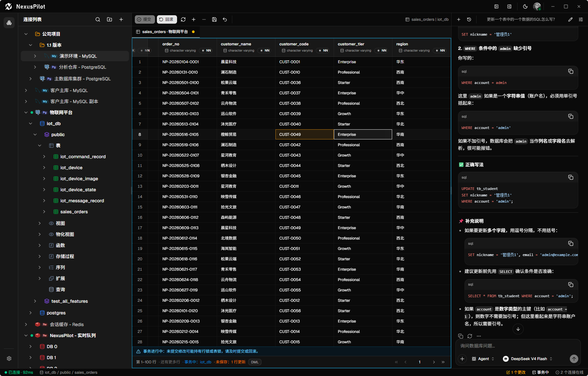
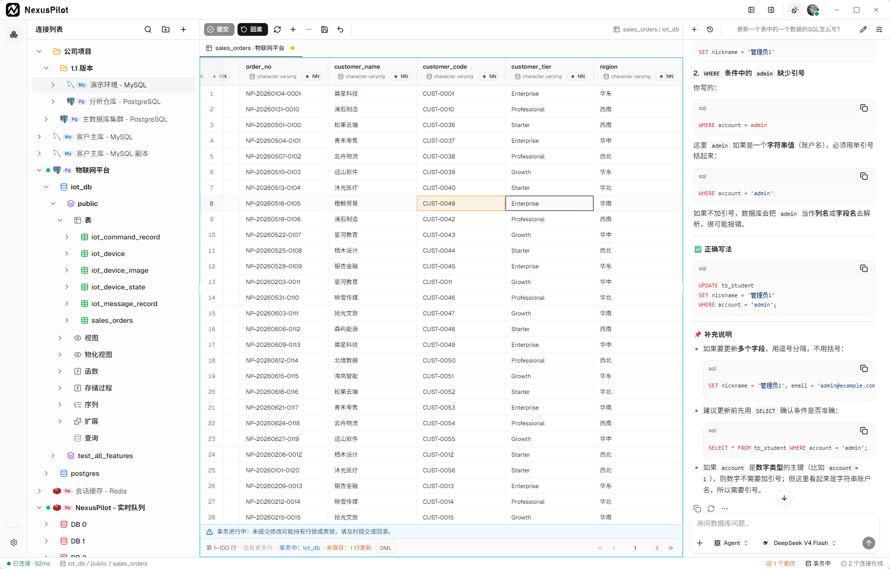

<p align="center">
  
</p>

<h1 align="center">NexusPilot</h1>

<p align="center">
  <b>用自然语言和你的数据库对话</b><br/>
  一个理解真实连接、引擎原生对象和数据结果的 AI Native 多数据库工作台。
</p>

<p align="center">
  <a href="LICENSE"></a>
  
  
  
  
</p>

[English](./README.md) | 简体中文

**NexusPilot** 面向开发者和数据团队，让智能体在真实连接、引擎原生对象和数据结果的上下文中，用自然语言协助探索不同形态的数据源，并通过受控工具完成实际操作。项目基于 **Tauri v2**、**React 19** 与 **Rust** 构建，并配有一个由 **Bun + Elysia + Vercel AI SDK** 驱动的本地 **AI Runtime** 侧车。

---

## ✨ 核心功能

- **自然语言数据智能体**：在 Ask、Query 和 Agent 模式中，用自然语言提出数据问题或多步骤任务。智能体基于真实的连接状态、引擎对象和数据结果理解上下文，按数据源能力协助查询、探索、解释和操作数据。
- **受控的智能体工具执行**：智能体通过工作台提供的受限工具使用数据源，而不是绕过应用建立隐藏连接。每次操作都会根据驱动能力、资源类型和风险级别独立校验；当前 SQL 与 Redis 写操作已接入风险分析和审批流程，高风险操作要求强确认。
- **多数据源连接与对象探索**：在统一连接树中管理关系型、键值型和分析型数据源，并持续扩展到更多数据形态。不同引擎展示自己的原生对象层级和可用操作，而不是被强行压缩为同一种表格模型。
- **面向引擎的查询与操作工作区**：根据数据源的原生交互方式提供适配工作面。当前支持带上下文的查询编辑、多语句结果与保存查询，也支持 Redis Key、类型化值和 TTL 操作；新数据源按各自能力接入，而不必复用 SQL 或表格交互。
- **数据内容查看与安全变更**：根据资源类型和驱动能力提供适配的数据视图。当前表与视图支持筛选、排序、分页及受控行变更，Redis 支持类型化值查看和 Key/TTL 操作；不能可靠定位或验证的数据保持只读。
- **引擎原生对象管理**：查看并管理每种数据源实际拥有的对象与结构。当前关系型驱动提供表结构读取、结构化设计和 DDL 预览；ClickHouse 进一步支持 Database、Table、View、Projection 和 Data-skipping Index 等原生对象。
- **自选模型与本地 AI Runtime**：在本地 AI Runtime 中管理 Provider、Model 和凭据，自动同步 models.dev 目录，并支持自定义 OpenAI-compatible Provider。智能体通过受控桥接复用工作台连接；前端不保存 LLM 凭据，不启用 AI 时工作台仍可独立使用。
- **端到端加密的跨设备同步**：通过 NexusPilot Cloud 在已授权设备间同步连接和文件夹，支持设备授权、冲突处理与 Recovery Key 恢复。Cloud 只保存密文，无法读取连接凭据；本地工作台及 AI Runtime 均不依赖 Cloud 才能运行。

## 🗄️ 支持的数据库

| 数据库 | 数据形态 | AI 工具接入 | 状态 |
|---|---|---|---|
| **PostgreSQL** | 关系型 | ✅ 已接入 | ✅ 支持 |
| **MySQL** | 关系型 | ✅ 已接入 | ✅ 支持 |
| **SQLite** | 关系型 | ✅ 已接入 | ✅ 支持 |
| **Redis** | 键值型 | ✅ 已接入 | ✅ 支持 |
| **ClickHouse** | 列式分析型 | ✅ 已接入 | ✅ 支持 |
| **Oracle** | 关系型 | ✅ 已接入 | ✅ 支持 |

> 此矩阵表示连接驱动的公开可用状态，不表示所有数据库拥有相同操作。“AI 工具接入”表示 AI Runtime 可通过工作台连接运行时使用该驱动当前已注册的连接、对象或数据工具，不表示所有读写和管理操作均已开放。具体能力由数据库引擎、服务端版本、连接权限和运行时能力共同决定。

## 📸 截图

| 深色 | 浅色 |
|---|---|
|  |  |

## 📦 安装

前往[官方下载页](https://nexuspilot.dev/releases)获取最新安装包。

| 平台 | 安装包 |
|---|---|
| Windows (x86_64) | NSIS 安装器（`.exe`） |
| macOS（Intel 与 Apple Silicon） | `.dmg` / `.app` |
| Linux (x86_64) | `.deb` / `.rpm` |

## 🚀 快速开始（开发）

环境要求：**Bun ≥ 1.3**（必须使用 Bun，不要用 pnpm/npm/yarn）与 **Rust toolchain**。

```bash
bun install

bun run dev:all         # 桌面应用 + AI Runtime 一起启动
# 或分别启动
bun run tauri dev       # Tauri 桌面应用（Vite，端口 1420）
bun run ai-runtime:dev  # 本地 AI Runtime 侧车（端口 8787）
```

### 提交前验证

```bash
bun run tsc --noEmit        # 前端类型检查
bun run ai-runtime:test     # AI Runtime 测试
cargo test --manifest-path src-tauri/Cargo.toml
cargo fmt --manifest-path src-tauri/Cargo.toml -- --check
cargo clippy --manifest-path src-tauri/Cargo.toml -- -D warnings
```

## 🧱 架构

| 层级 | 技术 |
|---|---|
| 前端 | React 19 · TypeScript · Tailwind CSS v4 · shadcn/ui |
| 桌面壳 | Tauri v2 |
| 后端 | Rust · SQLite（元数据存储）· sqlx / redis / clickhouse 驱动 |
| AI Runtime | Bun · Elysia · Vercel AI SDK（本地侧车） |
| 状态管理 | Zustand · TanStack Query · React Router |

```text
Frontend (React)
  ├─ Workbench UI ── Tauri IPC ──► Rust 后端 ──► 数据库驱动
  └─ Agent UI ── /v1/runs · /health · /v1/events ──► AI Runtime ── AI SDK ──► LLM API

Rust 后端 ── WebSocket Bridge ◄──► AI Runtime（工具执行）
```

**AI Runtime** 是本地侧车，统一管理 provider/model 配置、Run 执行、历史与实时事件。LLM 凭据不会离开它；AI 数据库工具与你的界面共用同一个 Rust 连接运行时。

可选的 **NexusPilot Cloud** 连接同步是独立的商业服务，不影响本地数据库连接、查询或 AI Runtime 的独立使用。

> 请妥善保存 Recovery Key。如果所有已授权设备和 Recovery Key 同时丢失，Cloud 中的加密同步资产将无法恢复。

## 🤖 AI 提供商

NexusPilot 采用由用户自行配置提供商的模式。你可以在本地 AI Runtime 中选择支持的 provider 和 model，并通过应用内的提供商设置配置凭据。

- AI Runtime 会自动从 [models.dev](https://models.dev) 同步 provider/model 供应商目录，将元数据缓存在本地，并在后台进行刷新。
- 如果远程目录暂时不可用，仍会继续使用最近一次可用的本地目录；必要时也可以配置自定义 provider 和 model。
- LLM 凭据由本地 AI Runtime 管理，前端不会直接保存这些凭据。
- AI 请求会发送到你选择的模型提供商，并可能产生相应的使用费用。
- 数据库工具通过工作台连接运行时执行，并遵循能力限制和变更审批边界。
- 即使不启用 AI 功能或 NexusPilot Cloud，也可以独立使用数据库工作台。

## 📚 文档

- [官网](https://nexuspilot.dev) —— 产品介绍、下载入口与发布日志
- [文档](https://docs.nexuspilot.dev) —— 安装、快速开始、数据库连接与 AI 助手指南
- [公开权威知识库](./docs/README.md) —— 架构、契约、产品边界、ADR 与贡献者指南
- [架构概览](./docs/architecture/overview.md) —— 系统边界与组件职责
- [贡献者开发指南](./docs/development/README.md) —— 实现、测试、扩展与发布指引
- [契约](./docs/contracts/README.md) —— IPC 与 Desktop-to-Cloud 公共兼容边界
- [AGENTS.md](./AGENTS.md) —— 面向 AI 编码代理与贡献者的开发规范

## 🤝 参与贡献

欢迎参与贡献。进行代码修改前，请先阅读 [AGENTS.md](./AGENTS.md)，了解构建命令、代码风格、架构说明和 AI 协作规范。

提交 Pull Request 前，请运行上方验证命令，并避免提交凭据、私有连接字符串、生成产物或无关的内部文档。

## 🛡️ 安全

如果发现安全漏洞，请通过 **GitHub 私有漏洞报告**（Security 标签页）或邮件 `support@nexuspilot.dev` 私下报告。

请不要为安全漏洞创建公开 issue。报告中请尽量提供受影响版本、操作系统、复现步骤和影响范围。不要包含密码、访问令牌、完整连接字符串或敏感业务数据；请使用脱敏值或占位符替代。

## 📜 许可证

本项目采用 [Apache License 2.0](./LICENSE) 开源。

NexusPilot 与 NIEEX 为维护者商标，详见 [NOTICE](./NOTICE)。
