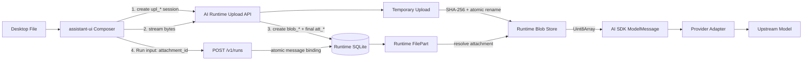

# Agent 聊天附件存储与多模态输入（Phase 1）

Status: **Current**

本文定义 NexusPilot 桌面 Agent 第一阶段聊天附件能力的权威设计。范围覆盖附件导入、本地持久化、消息绑定、历史恢复、模型输入投影、错误语义、安全限制和垃圾回收；不覆盖 Provider Files API 缓存、云同步、内容抽取或应用级静态加密。

本文所述 Phase 1 协议、持久化、Run 投影与前端交互已经落地；[provider-model.md](./provider-model.md)、[runner-core.md](./runner-core.md)、[domain.md](./domain.md) 与用户指南同步记录当前实现事实。

## 1. 背景与目标

用户需要在 Agent 对话中发送图片、音频、PDF、文本文件及其他模型可能支持的附件。NexusPilot 已经使用 AI SDK 7 统一接入 OpenAI、Anthropic 和 OpenAI-compatible Provider，因此附件协议不应复制各 Provider 的能力矩阵和请求格式。

Phase 1 的目标是：

1. Composer 支持选择、拖拽和移除附件，并显示上传状态；
2. 附件内容由 AI Runtime 管理，应用重启后聊天历史仍能恢复；
3. 消息只保存稳定的附件引用，不保存 Base64/data URL 或用户原文件路径；
4. Runtime 使用 AI SDK `ModelMessage` 的标准 `file` part 把附件交给当前模型；
5. Runtime 不根据模型目录的能力字段阻止发送；
6. AI SDK adapter 或上游 Provider 拒绝附件时，Run 进入可审计失败态，并向用户展示安全、可理解的错误；
7. 上传、落盘、消息绑定、消息删除和崩溃恢复都具有明确的一致性语义；
8. 文件数量、大小、总存储、访问授权和日志脱敏由 Runtime 强制执行。

## 2. 核心决策

### 2.1 Runtime 是附件的本地事实所有者

附件导入后复制到 AI Runtime 的 `dataDir`。聊天历史不依赖用户选择时的原始路径，也不依赖某个 Provider 的远端 file ID。

原文件路径不得作为消息附件的权威引用，默认也不长期持久化完整路径。原因包括文件移动或删除、桌面权限失效、同一路径内容被替换、跨设备无意义，以及原路径可能泄露用户名或目录结构。

### 2.2 文件系统保存字节，SQLite 保存元数据和引用

原始附件字节保存在 Runtime 管理的 blob 目录；SQLite 保存 Blob、Attachment 和 Message Part 之间的关系。消息 JSON 只包含不透明 `attachmentId` 及必要展示元数据。

Phase 1 不把原始文件存为 SQLite BLOB，也不在 `message_json`、`payload_json`、Event、Trace 或 HTTP JSON 中持久化 data URL。缩略图等小型派生资产不在本阶段实现。

### 2.3 Blob 与 Attachment 分离

- **Blob** 表示物理字节，按 SHA-256 内容寻址并允许去重；
- **Attachment** 表示一次用户可见的逻辑导入，保存文件名、媒体类型和生命周期；
- **FilePart** 表示一条消息对 Attachment 的引用。

相同字节可以对应多个 Attachment，因此用户在不同消息中使用不同文件名时仍保留各自展示语义，同时磁盘只保存一份内容。

### 2.4 不做模型附件能力门禁

`supportsVision`、`supportsAttachments` 和 `inputModalities` 继续作为目录与设置页的展示事实，不参与上传按钮、发送按钮或 `/v1/runs` 的准入判断。

Runtime 只检查协议、安全、所有权、完整性和资源限制。附件能否被当前模型消费，由以下执行层决定：

1. AI SDK Provider adapter 的格式转换与能力约束；
2. 上游 Provider API；
3. 当前 Provider 下实际选中的 Model。

“不支持附件”可能在 AI SDK adapter 本地抛错，也可能由上游 HTTP API 返回。两者都按模型执行错误处理。Runtime 不得静默移除附件、自动切换模型或只发送文本重试。

### 2.5 Runtime 读取本地字节，不把 loopback URL 交给 Provider

本地内容读取 URL 只服务于 NexusPilot UI。创建模型输入时，Runtime 根据 `attachmentId` 读取 blob，并构造 AI SDK `FilePart` 的字节数据。

不得把 `http://127.0.0.1:.../v1/attachments/...` 作为远程 URL交给云 Provider，因为 Provider 无法访问用户机器的 loopback 地址，也不应获得 Runtime access token。

## 3. 范围与非目标

### 3.1 Phase 1 包含

- Composer 选择、拖拽、粘贴文件的底层能力；
- 图片和普通文件的 Composer/消息展示；
- 独立 UploadSession 的两阶段上传、状态恢复和取消；
- 文件系统 blob store；
- SHA-256 完整性和物理去重；
- SQLite 元数据、消息引用和 GC 状态；
- `text` 与 `file` Run input parts；
- 文本加附件和纯附件消息；
- AI SDK `ModelMessage` 多模态投影；
- 历史恢复和受认证内容读取；
- 单文件、单消息、总磁盘配额；
- 过期 UploadSession 清理、无引用附件 GC、启动修复；
- Provider/adapter 错误的安全展示；
- 对话编辑、分支裁剪和物理删除时的引用一致性。

### 3.2 Phase 1 不包含

- 根据模型目录自动隐藏、禁用或拒绝附件；
- OCR、PDF 文本抽取、音频转写、视频抽帧或压缩包解压；
- 自动修改、压缩、转码用户原文件；
- Provider Files API 上传和 provider file ID 缓存；
- 附件云同步、分享链接或跨设备下载；
- 应用级附件加密；
- 缩略图、音频波形、全文搜索和附件库；
- 任意远程 URL 作为用户附件；
- 目录上传；
- Agent 自动生成文件并把它加入用户消息。

不做应用级加密不改变现有安全边界：附件目录必须限制为当前操作系统用户可访问，并依赖 BitLocker、FileVault、LUKS 等系统磁盘加密提供基础静态保护。

## 4. 总体架构



职责边界如下：

| 组件 | 职责 |
| --- | --- |
| Frontend attachment adapter | 管理 Composer 本地文件、上传进度、取消、预览，以及 `upl_*` 到最终 `att_*` 的映射。 |
| UploadSession HTTP routes | 认证、请求校验、上传状态机、状态恢复和用户主动取消；只有完整上传成功后才返回最终 Attachment。 |
| Attachment HTTP routes | 查询安全元数据、读取内容和删除未绑定 Attachment；不接收上传字节。 |
| Attachment service | 配额、哈希、媒体类型、原子落盘、逻辑 Attachment 和 Blob 绑定。 |
| Blob store | 只接受受控 storage key；负责临时文件、最终文件、读取和物理删除。 |
| Runtime Store | 持久化附件元数据、消息引用、生命周期状态和 GC 候选。 |
| Run request adapter | 把 AI SDK UI file part 映射成 `/v1/runs` 的 `attachment_id`，不发送文件内容。 |
| Runtime Runner | 原子绑定附件与 User Message，并从消息历史构造 AI SDK `ModelMessage`。 |
| History adapter | 读取附件描述符，以带认证的 fetch 获取内容，并为 UI 创建短生命周期 object URL。 |

这些组件不得互相绕过：Runner 不读取用户原路径，Frontend 不读取 Runtime 存储路径，HTTP route 不把磁盘路径返回给调用者。

## 5. 存储布局

Runtime 使用现有 `dataDir`，新增 `attachments` 子目录：

```text
<dataDir>/
├── ai-runtime.sqlite3
└── attachments/
    ├── blobs/
    │   └── sha256/
    │       └── 3a/
    │           └── 9f/
    │               └── 3a9f...e912.blob
    └── tmp/
        └── upload_upl_<id>_<random>.part
```

规则：

- 最终 blob 文件名只使用小写十六进制 SHA-256，不使用用户文件名；
- 使用哈希前四位分成两级目录，避免单目录文件过多；
- SQLite 只保存相对于附件根目录的 `storage_key`；
- 解析 `storage_key` 后必须验证规范化绝对路径仍位于附件根目录；
- 所有临时文件使用随机后缀，并以独占创建方式打开；
- 临时文件和最终文件位于同一文件系统卷，以便使用原子 rename；
- 应用不得向调用方返回 `dataDir`、临时路径或最终绝对路径。

## 6. 领域模型

### 6.1 Blob

```ts
interface RuntimeBlob {
  id: BlobId;
  sha256: string;
  byteLength: number;
  storageKey: string;
  state: "available" | "deleting" | "corrupt";
  createdAt: number;
  verifiedAt?: number;
}
```

Blob 是物理存储事实。`sha256 + byteLength` 必须与最终文件一致。`storageKey` 由 Runtime 生成，不能来自 API 输入。

### 6.2 UploadSession

UploadSession 只表示专用上传 API 的一次可恢复会话，不是消息可引用的附件：

```ts
interface RuntimeAttachmentUpload {
  id: UploadId;
  filename: string;
  declaredMediaType?: string;
  declaredByteLength: number;
  state: "pending" | "completed";
  attachmentId?: AttachmentId;
  createdAt: number;
  updatedAt: number;
  expiresAt: number;
}
```

稳定身份分为三层：

- `upl_*`：上传会话，只能用于 `/v1/attachment-uploads`，不能进入 Run 或 Message；
- `att_*`：上传完成后的逻辑附件，是消息和 `/v1/runs` 唯一可引用的附件身份；
- `blob_*`：物理字节记录，只在 Runtime 内部使用，永不返回前端。

上传中的互斥状态由进程内 per-upload registry/mutex 表达，不持久化 `uploading` 状态。只有文件字节完整写入 `dataDir`、SHA-256 已计算、Blob 已插入或成功复用、Attachment 索引已建立后，UploadSession 才能原子变为 `completed` 并关联最终 `att_*`。

### 6.3 Attachment

```ts
interface RuntimeAttachment {
  id: AttachmentId;
  blobId: BlobId;
  filename: string;
  declaredMediaType?: string;
  mediaType: string;
  byteLength: number;
  state: "ready" | "corrupt" | "deleting";
  createdAt: number;
  updatedAt: number;
  gcAfter?: number;
}
```

含义：

- `ready`：已关联可用 Blob，可以加入消息；
- `corrupt`：数据库记录与磁盘事实不一致，禁止发送；
- `deleting`：已进入物理删除流程，禁止建立新引用。

`declaredMediaType` 来自桌面 File 对象，仅用于诊断；`mediaType` 是 Runtime 最终采用的 IANA media type。Runtime 可以根据文件头识别常见格式：识别成功时使用检测结果；无法识别时使用语法有效的声明值；两者都不可用时使用 `application/octet-stream`。

媒体类型识别是协议和安全处理，不代表当前模型支持该媒体类型。

Attachment 创建时就已经是 `ready`；其 `blobId`、文件名、最终媒体类型和字节数不可变。需要替换内容时必须创建新的 UploadSession 和 Attachment。上传完成但未绑定消息时，`gcAfter = now + 24h`；至少被一条消息绑定时为 `null`；最后一个消息引用被删除时设为 `now + 1h`；宽限期内重新绑定则再次清空。这个约束保证历史 FilePart 的展示快照不会随时间漂移。

### 6.4 Message FilePart

内部 FilePart 使用明确的附件引用：

```ts
interface FilePart extends BasePart {
  type: "file";
  attachmentId: AttachmentId;
  mediaType: string;
  filename: string;
  byteLength: number;
}
```

以下字段不进入 Phase 1 FilePart：

- 用户原始路径；
- data URL/Base64；
- Runtime 绝对路径；
- Provider file ID；
- access token；
- 任意远程 URL。

现有原型中的 `url`、`dataRef` 和 `source` 字段不保留兼容分支；当前没有需要迁移的真实用户附件数据，可以直接收敛为上述 `attachmentId` 与不可变展示快照。

FilePart 中的展示元数据是创建消息时的不可变快照。物理内容以 `attachmentId → blobId` 为权威引用。快照与 Attachment 记录不一致时，Runtime 拒绝模型执行并记录完整性错误，不静默改写历史消息。

## 7. SQLite Schema

Phase 1 通过 Runtime migration 新增四张表：

```sql
CREATE TABLE runtime_attachment_uploads (
  id TEXT PRIMARY KEY,
  filename TEXT NOT NULL,
  declared_media_type TEXT,
  declared_byte_length INTEGER NOT NULL CHECK (declared_byte_length >= 0),
  state TEXT NOT NULL CHECK (state IN ('pending', 'completed')),
  attachment_id TEXT,
  created_at INTEGER NOT NULL,
  updated_at INTEGER NOT NULL,
  expires_at INTEGER NOT NULL,
  FOREIGN KEY (attachment_id) REFERENCES runtime_attachments(id) ON DELETE CASCADE,
  CHECK (
    (state = 'pending' AND attachment_id IS NULL) OR
    (state = 'completed' AND attachment_id IS NOT NULL)
  )
);

CREATE TABLE runtime_blobs (
  id TEXT PRIMARY KEY,
  sha256 TEXT NOT NULL UNIQUE,
  byte_length INTEGER NOT NULL CHECK (byte_length >= 0),
  storage_key TEXT NOT NULL UNIQUE,
  state TEXT NOT NULL CHECK (state IN ('available', 'deleting', 'corrupt')),
  created_at INTEGER NOT NULL,
  verified_at INTEGER
);

CREATE TABLE runtime_attachments (
  id TEXT PRIMARY KEY,
  blob_id TEXT NOT NULL,
  filename TEXT NOT NULL,
  declared_media_type TEXT,
  media_type TEXT NOT NULL,
  byte_length INTEGER NOT NULL CHECK (byte_length >= 0),
  state TEXT NOT NULL CHECK (state IN ('ready', 'corrupt', 'deleting')),
  created_at INTEGER NOT NULL,
  updated_at INTEGER NOT NULL,
  gc_after INTEGER,
  FOREIGN KEY (blob_id) REFERENCES runtime_blobs(id) ON DELETE RESTRICT
);

CREATE TABLE runtime_message_attachments (
  part_id TEXT PRIMARY KEY,
  message_id TEXT NOT NULL,
  attachment_id TEXT NOT NULL,
  sort_index INTEGER NOT NULL,
  FOREIGN KEY (part_id) REFERENCES runtime_message_parts(id) ON DELETE CASCADE,
  FOREIGN KEY (message_id) REFERENCES runtime_messages(id) ON DELETE CASCADE,
  FOREIGN KEY (attachment_id) REFERENCES runtime_attachments(id) ON DELETE RESTRICT,
  UNIQUE (message_id, sort_index)
);

CREATE INDEX idx_runtime_attachments_blob
  ON runtime_attachments(blob_id);

CREATE INDEX idx_runtime_attachments_state_expiry
  ON runtime_attachments(state, gc_after);

CREATE INDEX idx_runtime_attachment_uploads_state_expiry
  ON runtime_attachment_uploads(state, expires_at);

CREATE INDEX idx_runtime_message_attachments_attachment
  ON runtime_message_attachments(attachment_id);

CREATE INDEX idx_runtime_blobs_state
  ON runtime_blobs(state);
```

### 7.1 权威与重复字段

- `runtime_messages.message_json` 保存完整 Message 快照；
- `runtime_message_parts.payload_json` 保存完整 Part 快照；
- `runtime_message_attachments` 是 FilePart 引用的关系索引，用于外键、GC 和高效反查；
- `runtime_attachment_uploads` 只保存上传协议状态；完成后关联最终 Attachment，但 `upl_*` 不进入消息；
- 三者必须在同一个 Runtime Store 事务内写入；
- `runtime_message_attachments.part_id/message_id/attachment_id/sort_index` 必须和相应 FilePart 及其顺序一致；
- Store 读取消息时若发现关系索引与 Part payload 不一致，返回数据完整性错误并把对应 Attachment 标记为 `corrupt`，不得猜测修复。

`saveMessage()` 当前会重写 message parts。扩展后，它必须在同一事务内重建对应的 `runtime_message_attachments`，不能留下旧引用或短暂提交一个没有引用索引的 Message。

### 7.2 Attachment 和 Blob 删除关系

外键使用 `RESTRICT`，物理删除由显式 GC 状态机完成，不依赖级联删除 Blob：

1. 消息删除级联移除 `runtime_message_attachments`；
2. 无消息引用的 Attachment 成为 GC 候选；
3. GC 删除 Attachment 记录；
4. 无 Attachment 引用的 Blob 才能进入 `deleting` 并删除物理文件；
5. 文件删除成功后删除 Blob 记录。

## 8. UploadSession 与 Attachment HTTP API

所有端点都位于 `/v1`，必须使用现有 Runtime access token。Upload ID、Attachment ID 和 Blob ID 分别使用不可预测的 `upl_<random>`、`att_<random>` 和 `blob_<random>`；Run 只接受 `att_*`，外部 API 永不返回 `blob_*`。

### 8.1 创建 UploadSession

```http
POST /v1/attachment-uploads
Content-Type: application/json
Authorization: Bearer <runtime-token>
```

请求：

```json
{
  "filename": "schema.png",
  "media_type": "image/png",
  "byte_length": 183421
}
```

响应 `201 Created`：

```json
{
  "upload_id": "upl_01...",
  "state": "pending",
  "expires_at": 1788259200000
}
```

创建时执行：

- 规范化为 basename，移除路径分隔符和控制字符；
- 文件名 UTF-8 编码后最多 255 bytes，超出时保留扩展名并安全截断；
- 空文件名使用 `attachment`；
- `media_type` 最多 127 个 ASCII 字符，必须满足 `type/subtype` 基本语法；
- `byte_length` 必须为非负整数且不超过单文件上限；
- 只检查声明长度与 Runtime 实例级 pending UploadSession 数量；是否新增物理 Blob 以及是否超过物理存储配额，在内容哈希完成后判断，这样达到配额时仍可复用已有相同 Blob；
- `expires_at` 固定为创建后 24 小时。

Runtime 当前没有独立客户端身份，因此限制是“单个 Runtime 实例最多同时存在 20 个未过期 pending UploadSession”，不是按客户端计数。UploadSession 不占用最终 Blob 配额，也不是 Attachment。

### 8.2 上传原始内容并创建最终 Attachment

```http
PUT /v1/attachment-uploads/:uploadId/content
Content-Type: application/octet-stream
Content-Length: 183421
Authorization: Bearer <runtime-token>
```

请求 body 是原始字节，不是 Base64、JSON 或 multipart。元数据已经在创建步骤提交，因此文件名不通过 header 重复传输。

上传规则：

- UploadSession 必须存在、未过期且处于 `pending`；
- 同一 UploadSession 同时只允许一个 PUT，由进程内 per-upload mutex 保证；并发请求返回 `409`；
- `Content-Length` 必须存在，并与创建时声明值一致；Runtime 仍需边读取边计数，不能只相信 header；
- 读取过程中边写临时文件、边计算 SHA-256、边执行单文件上限；
- 客户端断开、取消或长度不匹配时关闭并删除临时文件，UploadSession 保持 `pending`，允许重新 PUT；
- 只有字节落盘、媒体类型检测、Blob 去重和最终 Attachment 索引全部成功后，事务才创建 `att_*` 并把 UploadSession 更新为 `completed`；
- 已经 `completed` 的 UploadSession 再次 PUT 返回相同最终 Attachment，支持响应丢失后的幂等恢复；
- 响应不得包含 SHA-256、data URL、本地路径或 Blob ID。

成功响应 `200 OK`：

```json
{
  "upload_id": "upl_01...",
  "state": "completed",
  "attachment": {
    "id": "att_01...",
    "filename": "schema.png",
    "media_type": "image/png",
    "byte_length": 183421
  }
}
```

### 8.3 查询或取消 UploadSession

```http
GET /v1/attachment-uploads/:uploadId
DELETE /v1/attachment-uploads/:uploadId
```

- GET 对 `pending` 返回上传状态，对 `completed` 返回与 PUT 成功相同的最终 Attachment 描述，以便恢复丢失的响应；
- DELETE 会中断本进程正在进行的上传并清理临时文件；`pending` 会话随后删除；
- 删除 `completed` UploadSession 不等于删除其最终 Attachment；调用方如需清理尚未绑定的 Attachment，应另外调用 Attachment DELETE；
- 过期或不存在的 UploadSession 返回 `404`。

### 8.4 查询 Attachment 元数据

```http
GET /v1/attachments/:attachmentId
```

返回 Attachment 的安全元数据，不返回 `blobId`、`storageKey`、绝对路径、原始路径或 Upload ID。不存在返回 `404`，`corrupt/deleting` 状态仍可查询，以便 UI 展示明确错误。

### 8.5 读取 Attachment 内容

```http
GET /v1/attachments/:attachmentId/content
```

要求：

- Attachment 和 Blob 都必须可用；
- 返回稳定的 `ETag`，值来源于 SHA-256；
- 返回 `Content-Length`、最终 `Content-Type` 和安全的 `Content-Disposition`；
- 设置 `X-Content-Type-Options: nosniff`；
- Phase 1 只要求栅格图片可安全 inline；HTML、SVG、JavaScript、XML 及其他主动内容必须使用 `attachment` disposition；普通文件、音频、视频和 PDF 可以下载，但不要求内嵌播放器或阅读器；
- 仍然需要 Bearer token，不接受 query-string token，也不生成公开链接。

Frontend 使用带认证的 `fetch` 按需获取内容，再创建 `blob:` object URL 交给图片展示或下载组件。切换对话、移除消息或组件卸载时必须撤销 object URL。HTTP HEAD 和 Range 可后续按富媒体预览需求增加，不是 Phase 1 完成条件。

### 8.6 删除未绑定 Attachment

```http
DELETE /v1/attachments/:attachmentId
```

- 没有任何消息引用的 `ready` Attachment 可以进入删除流程；
- 已被消息引用时返回 `409 Conflict`；
- 删除操作进入相同 GC 流程，不要求 HTTP 请求同步完成物理 Blob 删除；
- 重复删除不存在的 Attachment 返回 `404`，删除 `deleting` Attachment 返回幂等成功。

## 9. Run 输入协议

`POST /v1/runs` 的 `input.parts` 扩展为有序联合类型：

```ts
type RunCreateInputPart =
  | { type: "text"; text: string }
  | { type: "file"; attachment_id: string };
```

示例：

```json
{
  "response_mode": "stream",
  "model": {
    "provider_id": "openai",
    "model_id": "gpt-4.1"
  },
  "agent_mode": "ask",
  "input": {
    "parts": [
      {
        "type": "text",
        "text": "请解释这张架构图"
      },
      {
        "type": "file",
        "attachment_id": "att_01..."
      }
    ]
  }
}
```

聊天/Run 接口不负责上传或创建附件。协议只接受最终 `attachment_id`，明确拒绝文件内容、Base64/data URL、Blob URL、HTTP URL、本地路径、Provider file ID、`upl_*` Upload ID，以及客户端重新声明的文件名、媒体类型或字节数。

### 9.1 有效性规则

- `parts` 至少包含一个有效 part；
- 文本 trim 后为空的 part 被拒绝，而不是静默保存；
- 允许只有 FilePart 的消息；
- 每条消息最多 10 个 FilePart；
- 同一消息引用同一个 Attachment 多次返回 `422`；
- 所有 Attachment 必须存在、处于 `ready` 且 Blob 可用；
- 本轮 Attachment 总字节数不得超过 50 MiB；
- 构造本次 Run 的完整模型历史时，所有待发送附件的累计字节数不得超过 100 MiB；
- 文件顺序与文本/文件交错顺序必须原样保留；
- Runtime 不读取客户端提交的完整历史，只处理本轮 input parts；
- continuation 请求不重复提交附件，等待审批后的同一 Run 继续使用已持久化 Message Parts。

### 9.2 消息标题

新对话标题规则：

1. 存在非空文本时，沿用当前文本摘要标题；
2. 只有附件时，使用第一个附件的规范化文件名；
3. 文件名不可用时使用“新对话”。

自动标题生成只接收文本，不再次把附件发给标题模型。纯附件消息保留回退标题。

## 10. 上传落盘与去重算法

文件系统和 SQLite 不能组成一个 ACID 事务，因此使用“临时文件 + 内容寻址 + 可修复状态”的提交协议。

### 10.1 正常流程

1. 创建 `pending` UploadSession，此时不存在最终 Attachment；
2. 以独占方式创建随机临时文件；
3. 流式读取请求 body，同时写文件、计数和计算 SHA-256；
4. 校验实际长度、声明长度和上限；
5. flush 并关闭临时文件；
6. 根据 SHA-256 计算最终 `storageKey`；
7. 获取进程内 per-hash mutex，并查询是否已有 `available` Blob：
   - 已有且长度一致：删除临时文件，复用 Blob；
   - 已有但长度不一致：视为存储完整性错误，双方都不能自动复用；
   - 不存在：把临时文件原子 rename 到最终路径；
8. SQLite 事务插入或复用 Blob、创建不可变的 `ready` Attachment，并把 UploadSession 更新为 `completed` 且关联该 Attachment；
9. 为新建但尚未绑定消息的 Attachment 设置 `gc_after = now + 24h`；
10. 返回 UploadSession 与最终 Attachment 的安全元数据。

如果并发上传相同内容，进程内 per-hash mutex 先将常规路径串行化，SQLite 的 SHA-256 unique constraint 作为最终收敛保证。失去竞态的一方复用胜者记录并删除自己的临时文件。Windows 上不得假定覆盖式 rename 具有 POSIX 语义：目标已存在时应重新核对胜者记录与长度，然后复用，不能覆盖目标文件。

### 10.2 崩溃窗口

| 崩溃位置 | 启动后处理 |
| --- | --- |
| 写临时文件期间 | 超过 TTL 的 `.part` 文件删除，pending UploadSession 继续等待或到期清理。 |
| 临时文件完成、rename 之前 | 临时文件按 TTL 清理。 |
| rename 之后、SQLite Blob 提交之前 | 最终路径成为无数据库记录的孤儿，启动扫描在宽限期后删除。 |
| Blob 文件可见、SQLite 事务提交之前 | 文件可能成为无数据库记录的孤儿，启动扫描在宽限期后删除。 |
| UploadSession、Blob、Attachment 事务已提交、响应返回之前 | 客户端通过 GET UploadSession 或幂等重试 PUT 恢复同一个最终 Attachment。 |

Phase 1 不要求每次启动对所有大文件重新计算完整 SHA-256。启动修复先检查存在性和字节数；只有状态可疑、长度不一致或显式诊断时重新哈希，并更新 `verifiedAt`。

## 11. 消息绑定与事务语义

Attachment 上传完成不等于已经成为聊天事实。它只有在 Run 创建事务成功后才绑定到 User Message。

`commitRunStart` 扩展为以下原子操作：

1. 校验目标 Conversation 和 replace/edit 边界；
2. 在事务内重新读取所有 Attachment，确认 `ready`、未进入删除且 Blob 为 `available`；
3. 创建 User Message 和有序 Text/File Parts；
4. 写入 `runtime_message_attachments` 引用索引；
5. 创建 Run、Assistant Message、Conversation busy 状态、Event 和 Trace；
6. 对新绑定 Attachment 清除 `gc_after`；对事务中失去最后一个引用的 Attachment 设置 `gc_after = now + 1h`；
7. 提交后才开始模型调用。

任何一步失败都不得留下半条 User Message、孤立 FilePart、没有引用索引的 Message 或已 busy 但没有 Run 的 Conversation。

消息编辑和分支裁剪必须在同一个事务中：

- 创建替换后的新消息及其附件引用；
- 删除被替换尾部的消息和旧引用；
- 保持仍被新消息复用的 Attachment 可用；
- 在同一事务中把真正无引用的 Attachment 写入 `gc_after = now + 1h`；宽限期内重新绑定时清空 `gc_after`。

active Run 期间继续禁止物理删除 Conversation 或替换相关消息，沿用现有 Conversation busy 约束。

## 12. AI SDK 模型消息投影

构造模型历史时，User Message 的 TextPart 和 FilePart 转换为 AI SDK 7 `ModelMessage`：

```ts
{
  role: "user",
  content: [
    {
      type: "text",
      text: "请解释这张架构图",
    },
    {
      type: "file",
      mediaType: "image/png",
      filename: "schema.png",
      data: {
        type: "data",
        data: bytes,
      },
    },
  ],
}
```

投影规则：

- Runtime FilePart 只能解析到 Runtime-owned Attachment；
- 读取前确认 Attachment/Blob 状态、文件存在和 byte length；
- 发现缺失或损坏时，在 Provider 调用前让 Run 失败；
- 不把本地内容 URL 作为 `data.type = "url"`；
- 不根据 Provider/Model catalog 过滤 FilePart；
- 不对媒体内容做转码或文本抽取；
- 历史消息中的附件在后续轮次仍进入模型上下文，保持无状态 LLM API 的对话语义；
- 同一轮需要读取多个附件时使用有界并发，并保证累计字节上限；
- Provider 调用结束后释放大 Buffer 引用，不把字节保存在 continuation metadata。

等待 Tool Permission 时，Runtime 已经持久化 User Message 和 FilePart。continuation 重新构造模型历史时从 Attachment Store 再次读取附件，不接受客户端重新上传或替换内容。

## 13. Frontend 与 assistant-ui 集成

Frontend 使用自定义 Runtime Attachment Adapter，不使用把整个 File 转为 data URL 的通用 adapter。

### 13.1 Composer 状态

每个 Composer Attachment 至少维护：

```ts
interface ComposerRuntimeAttachmentState {
  localId: string;
  uploadId?: string;
  runtimeAttachmentId?: string;
  file: File;
  objectUrl?: string;
  progress: number;
  status: "local" | "creating" | "uploading" | "complete" | "error";
  error?: string;
}
```

行为：

- `add()` 立即使用本地 File/object URL 提供预览，同时创建 `upl_*` 并用 XHR PUT 原始 File；`xhr.upload.onprogress` 更新 assistant-ui 进度；
- 每个附件保存现有上传 Promise；上传完成后取得最终 `att_*`，但继续停留在 Composer 等待发送；
- 上传未完成时点击发送，`send()` 等待已有 Promise，不重复创建上传，也不提交半成品 Run；
- 上传失败保留文本和附件，允许重试或移除；
- 移除时中断 XHR：若仍是 `upl_*`，删除 UploadSession；若已取得未绑定 `att_*`，删除 Attachment；清理失败不阻止从 Composer 移除，但应记录诊断并交给 TTL/GC；
- 发送成功后 optimistic UI 可以继续使用本地 object URL；
- Snapshot 对账完成后以 Runtime 历史为准。

### 13.2 AI SDK UIMessage 到 Run 请求

assistant-ui 的 `Attachment.id` 不会进入 AI SDK `UIMessage`，不能作为 Run 请求的 ID 载体。Runtime Attachment Adapter 在上传完成后返回受控内部 scheme：

```ts
{
  status: { type: "complete" },
  content: [{
    type: "file",
    filename: "schema.png",
    mimeType: "image/png",
    data: "nexuspilot-attachment:att_01...",
  }],
}
```

`@assistant-ui/react-ai-sdk` 由此产生的 `FileUIPart.url` 形如 `nexuspilot-attachment:att_01...`。Run request adapter 只严格解析这一 scheme，提取最终 Attachment ID，并生成：

```json
{ "type": "file", "attachment_id": "att_01..." }
```

它不得把 `FileUIPart.url`、内部 scheme、data URL、Blob URL 或远程 URL 原样放进 Run JSON。scheme 必须完整匹配合法 `att_*`；若 UIMessage 存在无法解析的 file part，发送在 Frontend 失败并提示“附件尚未完成上传”。

Runtime Attachment ID 必须是最终请求的唯一文件身份。不得依赖仅存在于内存的映射，也不得把 ID 编码进用户可见文件名。

### 13.3 历史恢复

AI SDK history projection 对 FilePart 返回：

```ts
{
  type: "file",
  mediaType: part.mediaType,
  filename: part.filename,
  url: `nexuspilot-attachment:${part.attachmentId}`,
}
```

新消息与历史恢复统一使用该内部 scheme，因此编辑消息时也能稳定还原最终 Attachment ID。scheme 不是可请求 URL，更不能直接传给模型；附件展示组件在需要内容时解析 ID，使用当前 access token 调用内容 API，再转换成 object URL。为了避免打开长对话时立即下载全部附件：

- 文件元数据先渲染；
- 图片在进入可视区域或用户打开预览时加载；
- 普通文件只在用户下载时读取；Phase 1 不要求音频、视频播放器或 PDF 阅读器；
- object URL 由对话级资源管理器统一回收。

文件内容加载失败时仍显示文件名、媒体类型和“附件不可用”，不隐藏整条用户消息。

## 14. 限制与配额

Phase 1 使用以下固定默认值；后续可以暴露 Runtime settings，但修改设置不能放宽协议的绝对安全上限。

| 限制 | 默认值 | 作用点 |
| --- | ---: | --- |
| 单附件最大字节数 | 25 MiB | 创建 UploadSession、上传流、模型读取均检查。 |
| 单消息最大附件数 | 10 | Run request 和 commit transaction 均检查。 |
| 单消息附件总字节数 | 50 MiB | Run request 和模型投影均检查。 |
| 单次 Run 全历史附件总字节数 | 100 MiB | 构造模型历史、读取 Blob 前检查。 |
| Runtime pending UploadSession 数量 | 20 | 创建 UploadSession 时按单个 Runtime 实例检查。 |
| Runtime 物理 Blob 配额 | 2 GiB | 新增唯一 Blob 前检查；去重复用不重复计费。 |
| pending UploadSession TTL | 24 小时 | 创建时写入 `expires_at`。 |
| 消息解绑后的 GC 宽限期 | 1 小时 | 防止 UI/事务短时抖动导致立即物理删除。 |
| 临时上传文件 TTL | 24 小时 | 启动修复和周期清理。 |
| 附件读取并发度 | 2 | 构造模型历史时限制并发读盘和内存峰值。 |

配额按最终磁盘 Blob 物理字节计算，不按逻辑 Attachment 重复计算。达到配额时：

- 已有附件和历史仍可读；
- 复用已经存在的相同 Blob仍允许；
- 需要新增 Blob 的上传在完成哈希后返回配额错误并删除临时文件；
- Runtime 不自动删除仍被消息引用的历史附件；
- 错误提示应建议用户删除不再需要的对话或附件。

## 15. 安全与隐私

### 15.1 访问控制

- 所有 UploadSession 与 Attachment API 使用与其他 Runtime API 相同的 per-launch access token；
- 不接受 query token、公开签名 URL 或无认证 loopback 请求；
- Attachment ID 不可预测，但不可预测 ID 不替代认证；
- Frontend 只得到 Attachment ID 和内容端点，不得到 Blob ID/storage key；
- Blob store 的所有文件操作必须从受控 storage key 开始，不接收用户路径。

### 15.2 内容安全

- 客户端 media type 不可信；
- HTML、SVG、XML、JavaScript 等主动内容不做 inline WebView 渲染；
- Phase 1 不解析、执行、解压或抽取附件；
- 文件内容可能包含 Prompt Injection，只作为不可信用户输入；
- 附件内容不能修改 System Prompt、Tool Snapshot、Permission 或数据库风险策略；
- Agent 因附件内容发起数据库写操作时，继续走现有风险分析和审批。

### 15.3 日志和错误脱敏

允许记录：

- Attachment ID、Blob ID；
- 字节数、最终 media type；
- 状态转换、耗时、错误码；
- SHA-256 的短前缀，仅用于去重诊断。

默认禁止记录：

- 文件内容、Base64/data URL；
- access token；
- 用户原始路径；
- 完整 SHA-256；
- Provider 请求 body；
- 文件名。需要诊断文件名时只记录是否存在和长度，不记录原文。

UI 应在 Composer 首次添加附件时明确提示：附件会发送到当前选择的外部 AI Provider，并受该 Provider 的数据处理政策约束。

## 16. 错误模型

### 16.1 UploadSession、Attachment API 与 Run 校验错误码

| 错误码 | HTTP | 含义 |
| --- | ---: | --- |
| `UPLOAD_NOT_FOUND` | 404 | UploadSession 不存在。 |
| `UPLOAD_EXPIRED` | 404 | UploadSession 已过期。 |
| `UPLOAD_IN_PROGRESS` | 409 | 同一 UploadSession 已有 PUT 正在执行。 |
| `UPLOAD_INTERRUPTED` | 409 | 客户端取消或连接中断；UploadSession 仍为 pending，可重试。 |
| `UPLOAD_LIMIT_EXCEEDED` | 429 | Runtime 实例的 pending UploadSession 数量已达上限。 |
| `ATTACHMENT_NOT_FOUND` | 404 | Attachment ID 不存在。 |
| `ATTACHMENT_TOO_LARGE` | 413 | 声明或实际字节数超过限制。 |
| `ATTACHMENT_COUNT_EXCEEDED` | 422 | 单消息附件数量超过限制。 |
| `ATTACHMENT_TOTAL_SIZE_EXCEEDED` | 422 | 单消息附件总字节数超过限制。 |
| `ATTACHMENT_HISTORY_SIZE_EXCEEDED` | 422 | 单次 Run 全历史附件总字节数超过限制。 |
| `ATTACHMENT_LENGTH_MISMATCH` | 422 | 声明、Content-Length 和实际字节数不一致。 |
| `ATTACHMENT_MEDIA_TYPE_INVALID` | 422 | media type 语法非法。 |
| `ATTACHMENT_QUOTA_EXCEEDED` | 507 | 新增唯一 Blob 会超过 Runtime 配额。 |
| `ATTACHMENT_IN_USE` | 409 | Attachment 已被消息引用，不能删除。 |
| `ATTACHMENT_CONTENT_MISSING` | 500 | 数据库存在但物理文件缺失。 |
| `ATTACHMENT_CORRUPT` | 500 | 长度、哈希或引用关系不一致。 |

Attachment API 与 Run 的附件校验建立专用的稳定错误 envelope：

```json
{
  "code": "ATTACHMENT_TOO_LARGE",
  "message": "附件超过 25 MiB 限制。",
  "data": {
    "limit_bytes": 26214400
  }
}
```

当前 Runtime 的通用 `detailError()` 只有 `{ "detail": "..." }`，不能宣称已经提供稳定错误码。本阶段只为 Attachment API 和 Run 附件校验引入上述结构化契约，不顺带重构其他 Runtime API。

### 16.2 Run 错误

Run 创建前的附件协议或资源校验错误不创建 Conversation、User Message 或 Run，也不改变现有 Conversation。`commitRunStart` 内的竞态校验失败同样不提交任何 Run 事实。

Run 已创建后，读取附件或调用 Provider 失败时：

- Run 进入 `failed`；
- Assistant Message 进入 `error`；
- User Message 及附件引用保留；
- Conversation 回到非 busy 状态；
- Runtime Error 保存安全 message、可重试性和可选 Provider status/request ID；
- live stream 和 Snapshot 最终展示一致错误；
- 不删除或改写用户附件。

如果 Run 已提交，但在 Provider stream 建立前读取附件失败，route 必须返回 AI SDK-compatible failure stream，并保留 Runtime stream headers，不能退化成普通 HTTP 500。

AI SDK `UnsupportedFunctionalityError` 和 Provider 的“不支持媒体/附件”响应应分别映射为安全可显示的信息。例如：

```text
当前 Provider adapter 不支持 audio/flac 输入。
```

```text
当前模型拒绝了该附件类型：application/pdf。
```

`toUIMessageStreamResponse()` 必须配置受控 `onError` 映射。AI SDK 默认的 `An error occurred.` 不能成为附件能力失败的唯一用户反馈。原始 Provider response body、headers、凭据和附件内容不得透传。

## 17. 垃圾回收与启动修复

### 17.1 周期 GC

Runtime 使用低优先级、可中断的周期 GC：

1. 删除过期 UploadSession；pending 会话同时清理临时文件，completed 会话只删除上传协议记录；
2. 找出没有 `runtime_message_attachments` 引用且 `gc_after <= now` 的 ready Attachment；
3. 把 Attachment 标记为 `deleting`；
4. 删除 Attachment record；关联它的 completed UploadSession 若仍存在，由外键级联删除；
5. 找出没有 Attachment 引用的 available Blob；
6. 把 Blob 标记为 `deleting`；
7. 删除物理文件；
8. 成功后删除 Blob record；失败则保留 `deleting`，下次重试。

GC 每批处理有限数量，不能长期占用 SQLite 写锁，也不能阻塞 Run stream。过期 UploadSession 同样通过按过期时间和 ID 排序的限批删除逐轮收敛，不执行无上限的单次 `DELETE`。

### 17.2 启动修复

Runtime Store migration 完成后、health 进入 ready 前执行有界修复：

- 删除超过 TTL 的临时 `.part` 文件；
- 重试 `deleting` Attachment/Blob；
- 检查 ready Attachment 是否指向 available Blob；
- 检查 available Blob 文件是否存在且长度一致；
- 把缺失或长度错误记录标记为 `corrupt`；
- 扫描最终 blob 目录中没有数据库记录且超过 24 小时的文件并删除；
- 不在启动热路径对所有 Blob 全量重新哈希。

修复结果进入结构化日志和 Runtime health diagnostics。单个历史附件损坏只让引用它的内容读取或 Run 失败，记录 diagnostics warning，但不得把全局 Runtime health 变为前端视作不可用的状态。只有附件根目录或 Runtime DB 整体不可用时，`GET /health` 才返回 HTTP 503、全局 `status: "unhealthy"` 与 `attachments.status: "unavailable"`；orphan、过期上传和待重试 GC 只产生 warning，并保持 HTTP 200 与全局 `status: "ok"`。

## 18. 删除、归档与编辑语义

| 操作 | 附件行为 |
| --- | --- |
| 归档 Conversation | 保留消息、Attachment 引用和 Blob。 |
| 取消归档 | 不改变附件。 |
| 物理删除 Conversation | 同事务删除消息和引用，Attachment 进入 GC 宽限期。 |
| 编辑 User Message | Composer 恢复原 FileParts；替换提交成功后按最终引用集合计算 GC。 |
| 取消编辑 | 不改变原消息引用；编辑期间新上传且未绑定的附件按 `gc_after` 清理。 |
| 裁剪消息尾部 | 删除对应引用；外部 Tool 副作用仍不撤销。 |
| Provider 执行失败 | 保留 User Message、FileParts、Attachment 和 Blob。 |
| 用户移除 Composer 附件 | 删除未绑定 Attachment 或让 TTL/GC 回收；不影响其他消息引用。 |

Attachment 不使用手工引用计数字段作为唯一事实；引用数由 `runtime_message_attachments` 查询得到，避免崩溃导致计数漂移。

## 19. 测试策略

### 19.1 单元测试

- 文件名、media type、ID 和大小规范化；
- 流式字节计数、SHA-256、长度不匹配和取消；
- storage key 路径边界与路径穿越拒绝；
- 相同内容去重、不同逻辑 Attachment 保留不同文件名；
- UploadSession/Attachment/Blob 状态转换；
- Run input text/file union schema；
- 纯附件标题；
- Runtime FilePart 到 AI SDK FilePart 的转换；
- Provider/adapter 错误安全映射；
- content disposition 和 inline allowlist；
- 配额计算不重复统计去重 Blob。

### 19.2 Store 与 migration 测试

- 新库创建四张表和索引；
- 老库 migration 不改写现有 text-only 消息；
- User Message、Parts、引用索引和 Run 原子提交；
- `saveMessage()` 重写 FilePart 时引用索引同步；
- 删除、编辑和分支裁剪后的引用集合；
- 外键阻止删除仍被引用的 Attachment/Blob；
- GC 状态可重入；
- 启动修复正确识别 missing/corrupt/orphan。

### 19.3 Route 测试

- UploadSession create/PUT/GET/DELETE 与 Attachment GET/content/DELETE 正常路径；
- 未认证和错误 token；
- missing Content-Length、超限、长度不一致、中途断开；
- 并发 PUT 同一个 UploadSession；
- PUT 成功响应丢失后，GET 或幂等重试返回同一个最终 Attachment；
- 并发上传相同 Blob；
- pending/completed UploadSession 与 ready/corrupt/deleting Attachment 状态冲突；
- 达到配额后仍允许复用相同 Blob；
- 内容响应不泄露路径和 token。

### 19.4 Runner 纵向测试

- 文本加单图片；
- 文本与多个 FilePart 的顺序保持；
- 纯图片、纯音频、纯 PDF 消息；
- Runtime 重启后历史恢复并再次向模型发送；
- Tool Permission 等待后 continuation 能重新加载原附件；
- AI SDK adapter 本地拒绝 media type；
- 上游模型拒绝附件；
- Blob 在 Run 开始前丢失；
- Provider 失败后 User Message 和附件仍存在；
- 单次 Run 全历史附件超过 100 MiB 时在 Provider 调用前失败；
- 没有任何 `supportsVision/supportsAttachments/inputModalities` 发送门禁。

### 19.5 Frontend 测试

- 选择、拖拽、粘贴、移除；
- 上传进度、取消和重试；
- 未完成上传时 `send()` 等待原上传 Promise，失败时不清空文本；
- 上传失败后 Composer 状态保留；
- 新消息、历史恢复和编辑都能从 `nexuspilot-attachment:att_*` 恢复同一 ID；
- 历史图片懒加载和 object URL 回收；
- 非预览附件下载；
- 编辑消息恢复原附件；
- 不支持附件的模型失败提示；
- 切换对话不泄漏前一对话 object URL 或附件状态。

## 20. 实施切片

Phase 1 应按以下依赖顺序实施，每个切片保持可验证：

1. **上传领域与 migration**：UploadSession/Blob/Attachment/FilePart 类型、四张表、Runtime Store 和一致性测试；
2. **Blob store 与 Attachment service**：临时文件、per-upload/per-hash 互斥、哈希、去重、Windows 原子落盘、配额和修复；
3. **UploadSession 与 Attachment API**：create、raw-byte PUT、状态恢复、metadata、content 和 delete；
4. **Run 协议与消息绑定**：file input part、纯附件消息、原子引用；
5. **AI SDK 投影与错误**：FilePart bytes、Provider 错误安全展示、continuation；
6. **Frontend adapter**：Composer 即时上传、进度、内部 scheme、Run 请求映射和历史内容 materialization；
7. **生命周期**：编辑、裁剪、删除、周期 GC 和启动 diagnostics；
8. **文档对账**：更新 provider-model、runner-core、domain、communication-boundaries 和用户指南中的当前事实。

在切片 1–5 完成前，Frontend 不应开放上传按钮；否则会出现 UI 可选文件但 Runtime 丢弃或拒绝的半成品状态。

## 21. 验收条件

Phase 1 只有同时满足以下条件才算完成：

1. 用户可以发送文本加附件或纯附件消息；
2. 附件字节不进入 Runtime 消息 JSON、Event、Trace 或日志；
3. 用户移动或删除原文件后，历史附件仍可读取并能在后续轮次发送给模型；
4. Runtime 重启后 Attachment、消息引用和 UI 历史一致；
5. 当前模型不支持附件时，Run 明确失败并展示安全错误，不静默降级；
6. 代码中不存在按模型目录附件能力阻止发送的分支；
7. Runtime 不把本地 loopback 内容 URL 发送给 Provider；
8. 上传中断、进程崩溃、删除失败和并发去重都能通过状态机收敛；
9. active Run、Permission continuation、消息编辑和 Conversation 删除不会产生悬空引用；
10. 数量、单文件、单消息总量、单次 Run 全历史总量和磁盘配额均由 Runtime 强制执行；
11. 内容端点经过认证，不能用 Attachment ID 构造任意路径；
12. 删除 Conversation 后，无引用 Attachment/Blob 能在宽限期后回收；
13. 前端 object URL 在切换对话和卸载时被撤销；
14. 文档中的 text-only 当前事实已随实现同步更新。

## 22. 后续演进边界

未来能力必须建立在本地 Attachment/Blob 权威事实之上：

- Provider Files API 只能是 `(blobId, providerId, accountFingerprint) → providerFileId` 的可失效缓存；
- 云同步按加密后的 Blob 内容和哈希传输，不能同步本地路径；
- 应用级加密需要为 Blob 增加算法、nonce 和 wrapped key 元数据，但不改变 Message FilePart；
- 缩略图、波形和文本抽取结果属于可重建派生资产，不能替代原 Blob；
- Storage settings 可以调整软配额，但协议仍需保留绝对上限；
- 对话 compaction 可以减少再次发送历史附件，但不能在仍有消息引用时删除原附件。

这些演进不应把 Provider-specific identity、云 URL 或派生文本写成消息附件的唯一事实来源。
