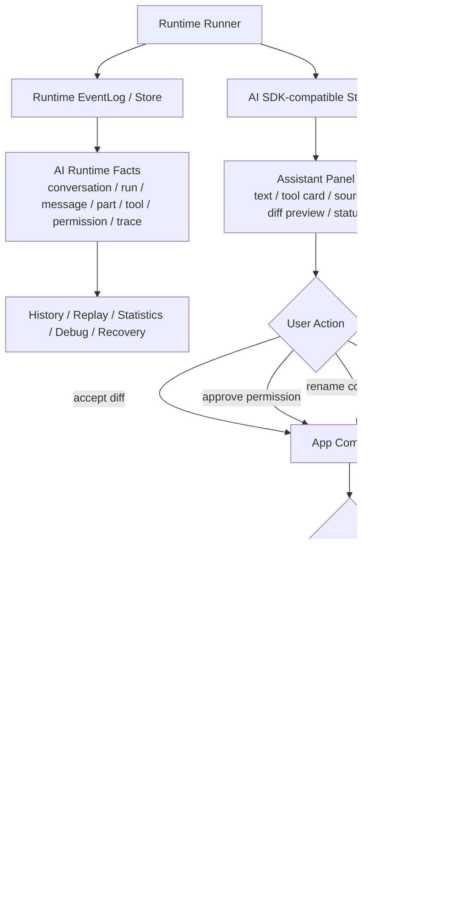
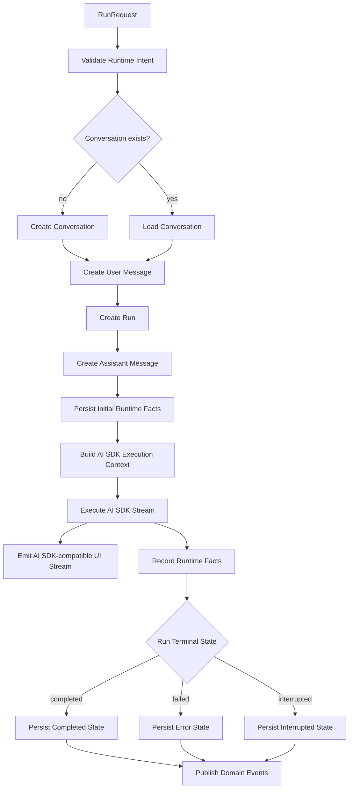
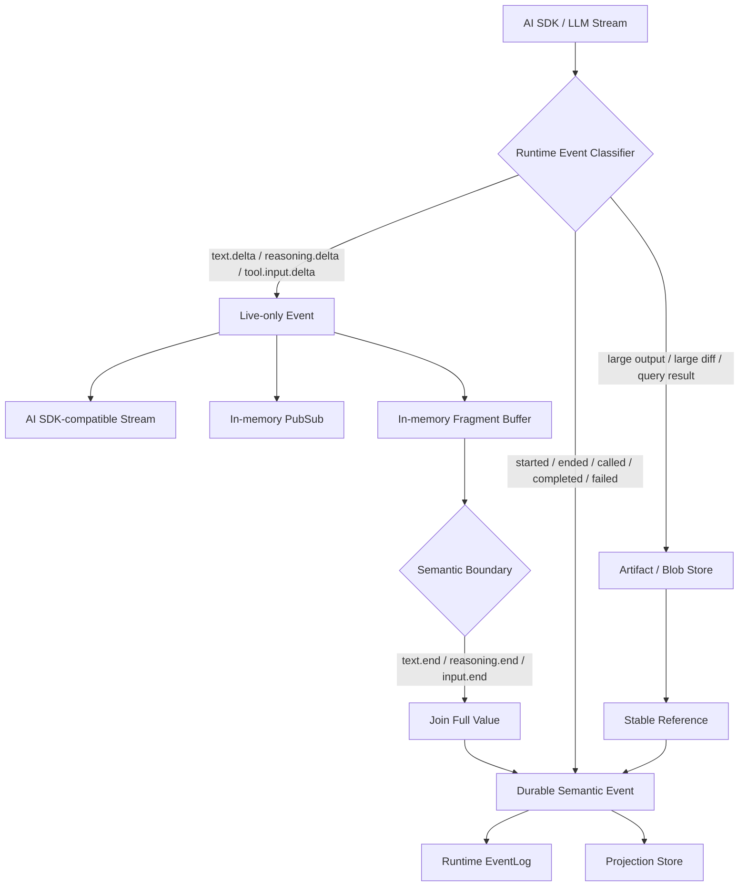

# AI Runtime Runner Core 设计原则

本文记录 NexusPilot AI Runtime Runner Core 的目标设计。它不是当前实现清单，也不描述具体代码结构；当前已经落地的领域模型、SQLite Store 和 migration 基础设施见 [domain.md](./domain.md)。Frontend EventBus/SSE、Frontend `/health` 与 Rust/Tauri Backend WebSocket Bridge 的职责边界以 [communication-boundaries.md](./communication-boundaries.md) 为准。

Runner Core 的设计目标是为后续 AI 对话、工具调用、权限审批、SQL diff、执行历史和调试回放建立稳定地基。第一版仍应保持在 `ai-runtime/` 自身范围内，不直接接入前端 UI、Rust/Tauri IPC 或数据库工作台业务工具。

## 核心判断

NexusPilot 的 AI 能力不是一个独立聊天机器人，也不是一个通用 agent 平台。它是数据库工作台内部的本地 AI Runtime。这个定位决定了三条边界：

- 前端 assistant 面板应尽量使用 AI SDK / assistant-ui 生态的原生渲染心智。
- AI Runtime 必须拥有自己的事实来源，用于历史、审计、恢复、统计和调试。
- 工作台真实状态变更必须通过明确 command/service 完成，不能让聊天流或事件总线直接绕过业务边界。

因此，Runner Core 的核心定位是：

```text
AI SDK-native execution coordinator + NexusPilot runtime state machine
```

它不是：

```text
custom agent event protocol adapter
```

这意味着 Runner 可以使用 AI SDK 作为模型执行、streaming 和 tool calling 的主执行协议，但 NexusPilot 仍然要维护自己的 Conversation、Run、Message、Part、ToolCall、Permission、Event 和 TraceEvent 事实模型。

## Agent Definition 先于工具

Runtime-local tools 不能直接绑定在 route 或 runner 的临时判断上。L3 在 Run 开始前生成不可变 Tool Snapshot，L4 实现 Runtime Tool Core，L5-A 已将正式 `web.fetch` 与 `web.ping` 通过 AI SDK 7 ToolLoopAgent adapter 接入该 Core。

第一版只支持系统内置 agent，不支持用户自定义智能体：

- `ask`：轻量问答模式，可启用安全 Runtime-local tools；当前工具包括 `web.fetch`、`web.ping` 与 `system.current_time`。
- `agent`：受控智能体模式，可启用 Runtime-local tools，并为后续更强的受控工具预留策略空间；当前 Runtime-local 工具同样包括 `web.fetch`、`web.ping` 与 `system.current_time`。

公开 Run 请求只表达运行意图和用户输入。`system`、`tools`、`limits` 不应由调用方传入，而应由 Runtime 根据 agent mode 解析。

字段命名上，`profileId` / `profile_id` 不作为目标语义。目标设计使用：

- 内部 TypeScript/domain：`agentMode`
- HTTP/OpenAPI 或 snake_case payload：`agent_mode`

`agentMode` 表达“本次 Run 使用哪一种内置 agent 运行模式”，不是用户 profile、账号配置或可变 persona。详细设计见 [agent-definition.md](./agent-definition.md)。

## 设计哲学

### 事实和渲染分离

AI SDK-compatible stream 负责回答：

```text
当前 assistant 回复应该如何被渲染？
```

Runtime EventLog / Store 负责回答：

```text
AI Runtime 事实上发生了什么？
```

App Command + 面向 Frontend 的 Global EventBus 负责回答：

```text
应用层要执行什么动作，以及哪些模块需要知道某个事实已经发生？
```

三者可以相互映射，但不能互相替代。尤其是 AI SDK-compatible stream 不能成为 Runtime 的最终事实来源，Global EventBus 也不能成为业务写入入口或 Rust/Tauri Backend Bridge。

### 显式 Run 是核心执行实体

OpenCode 的运行更偏向 Session + Message + Part + Status，单次运行没有独立 `Run` 作为第一等实体。NexusPilot 不采用这个取舍。

NexusPilot 必须保留显式 Run，因为后续能力会天然围绕一次执行展开：

- 中断、失败和重试。
- 权限等待和恢复。
- SQL diff 生成、审批和应用。
- 工具调用审计。
- token、cost、latency 和 provider/model 统计。
- 执行历史、debug timeline 和后台任务。

Conversation 表示长期上下文，Run 表示一次执行，Message 表示可见对话，Part 表示消息内部结构化内容。Run 不应被 Message 隐式替代。

### 改写历史后的续写

用户可以改写任意一条已完成的用户消息，并从该点重新执行。该动作不是“复用旧 Run”，也不是分支保留：Runtime 将目标用户消息及其后的有效消息视为一个待替换尾部，在同一事务中移除该尾部及关联 Run 事实，再创建新的用户消息、助手消息和 Run。模型上下文只能由裁剪后的 Store 装配，不能信任前端本地消息数组。

该命令必须拒绝 active Run，避免“执行中的工具仍在写入旧尾部”与历史裁剪并发。事务提交后才允许发布 `message.removed` / `run.updated` 等 EventBus 失效通知；前端收到通知后仍通过 Snapshot 对账。外部工具已经产生的副作用不属于对话历史，不能因改写而自动撤销。当前不支持助手消息重新生成，也不保留 `superseded` 或可切换分支。

### 事件是事实通知，不是动作本身

领域事件的语义必须是“已经发生了什么”，而不是“请去做什么”。

正确的模型是：

```text
Command -> Service/Store 写入 -> Domain Event -> Global Event Bus -> UI/Cache/Monitor 响应
```

错误的模型是：

```text
emit event -> 某个监听器碰巧修改状态
```

后者会让状态所有权、事务边界、失败语义、权限检查和幂等策略都变得模糊。事件总线可以广播事实，也可以承载临时 UI 协调信号，但不能替代 command 和 store。

### 重要数据必须可追溯

AI SDK stream 中出现的重要 UI 内容，最终必须能追溯到 Runtime Store / EventLog 中的事实或稳定引用。

例如：

- assistant 文本应能追溯到 Message / Text Part。
- web_fetch 结果应能追溯到 ToolCall / Source Part。
- SQL diff 提案应能追溯到 Diff Part / artifact id。
- permission card 应能追溯到 Permission。
- 工具执行结果应能追溯到 ToolCall / TraceEvent。

stream 可以比持久化更早抵达 UI，但它不能成为断线恢复、历史复现或统计审计的最终依据。

### 持久化必须有写入背压意识

Runtime EventLog 不能被理解为“所有运行时通知都逐条写入 SQLite”。如果把 token delta、tool stdout chunk、UI pulse、status heartbeat 等高频事件实时写入 SQLite，会把本地 sidecar 变成持续磁盘写入器，尤其在 Windows 桌面环境中容易造成卡顿、WAL 膨胀、后台 checkpoint 抖动和 UI 响应下降。

因此，Runner Core 必须从事件语义上区分：

```text
live-only event:
  服务实时 UI，允许高频，允许丢失，不进入 SQLite。

durable semantic event:
  表示可审计、可恢复、可回放的语义边界，允许进入 EventLog。

projection update:
  面向查询的当前状态更新，不等同于每个 live event 都 append。

artifact/blob:
  承载大对象，EventLog 只记录稳定引用、摘要和元数据。
```

OpenCode 的设计也体现了这个边界：text/reasoning/tool input 的 delta 是 live-only，完整值在 ended 边界才 durable；tool progress 也要求按语义变化或受限频率 checkpoint，而不是持久化每个 stdout/stderr chunk。NexusPilot 应借鉴这个思想，并将“禁止高频 delta 逐条落 SQLite”作为 Runner Core 的硬约束。

## 三通道模型

Runner Core 的上层架构应被理解为三条并行通道。



### 第一条：AI SDK-compatible Stream

这是 assistant 面板的主渲染协议。它面向 AI SDK / assistant-ui，而不是面向 NexusPilot 全局状态。

适合承载：

- 普通 assistant 文本。
- markdown、代码块、SQL 片段。
- reasoning、source、file 等消息 part。
- tool call 卡片和 tool state。
- 小型状态提示，例如正在分析、正在抓取网页、正在整理 SQL。
- web_fetch 结果摘要和引用来源。
- SQL diff 提案的可视化摘要。
- permission request 的展示卡片。
- 小型 query result preview 或 artifact preview。

不适合承载：

- Workbench 的真实状态变化。
- 数据库连接状态。
- Explorer 树刷新事实。
- SQL editor/tab 的最终写入状态。
- 大型查询结果数据。
- 长时间后台 run 的恢复事实。
- 审计、统计和 debug 的最终记录。

AI SDK-compatible stream 的职责是“让当前消息顺滑地显示出来”，不是“让整个应用状态发生改变”。

### 第二条：Runtime EventLog / Store

这是 AI Runtime 领域内的事实来源。消息记录复现、运行统计、权限审计、工具历史、错误诊断和 debug timeline 都应从这里来。

但这里的 EventLog 只记录 durable semantic events，不记录所有 live notifications。它偏向记录“在可恢复语义上发生过什么”：

- run created / completed / failed / interrupted。
- message created / completed。
- part started / completed / replaced / checkpointed。
- tool state snapshot / checkpointed / completed / failed。
- permission requested / resolved。
- trace recorded。

Store 偏向记录“当前是什么状态”：

- Conversation 的当前 title、status、metadata。
- Run 的当前状态、时间、usage、error。
- Message 和 Part 的完整结构。
- ToolCall 的当前输入、输出、状态和错误。
- Permission 的当前审批状态。
- TraceEvent 的结构化运行记录。

Store 偏向读模型和当前状态，不应被当作 token delta 的逐条落盘目标。EventLog 和 Store 共同构成 AI Runtime 的事实边界：EventLog 支持审计和回放，Store 支持高效查询和恢复当前状态，二者都不承载高频流式 delta 的完整过程。

### 第三条：App Command + 面向 Frontend 的 Global EventBus

第三条线不是“所有事情都发事件解决”，而是：

```text
Command 是写入入口；
Store/Service 是事实变更位置；
Global EventBus 是 AI Runtime 面向 Frontend 的 live-only、best-effort 通知机制。
```

它覆盖 AI Runtime 之外的全局 UI 与工作台协作场景，例如：

- 会话名称修改。
- 会话状态 UI 更新。
- thread list 刷新。
- status bar 状态变化。
- toast 请求。
- cache invalidation。
- panel focus / scroll / selection 协调。
- editor tab 打开。
- SQL diff 应用后的 editor/document 更新。
- query result 创建后的结果面板打开。

其中，凡是改变真实状态的动作必须走 command；只有失效通知和纯 UI 协调信号可以作为 best-effort transient event。Rust/Tauri 后端能力的 command/response、ready、heartbeat 和重连使用独立 Backend WebSocket Bridge，不进入 EventBus。

## 事件分类

下面三类是应用级语义分类，不是当前 EventBus envelope 的强制 taxonomy。当前 AI Runtime EventBus 只面向 Frontend 发布 Runtime 失效通知与 UI 协调信号；Workbench Domain Event 单列用于明确事实所有权，不表示 Rust/Tauri 是 EventBus consumer。

### Runtime Domain Event

Runtime Domain Event 来自 AI Runtime，是可审计、可回放、可恢复的领域事实。

典型事件：

- `conversation.created`
- `conversation.updated`
- `run.created`
- `run.status.updated`
- `run.completed`
- `run.failed`
- `run.interrupted`
- `message.created`
- `message.completed`
- `part.started`
- `part.completed`
- `part.checkpointed`
- `tool.updated`
- `tool.progress.checkpointed`（后续细分事件）
- `tool.completed`（后续细分事件）
- `tool.failed`（后续细分事件）
- `permission.updated`
- `trace.recorded`

这类事件应进入 Runtime EventLog，并能通过 Store 查询到当前状态。

### Workbench Domain Event（不属于当前 AI Runtime EventBus）

Workbench Domain Event 来自数据库工作台业务域。它不属于当前 AI Runtime EventBus，仍由数据库工作台自己的 Rust IPC、Frontend state/query cache 等机制维护。AI Runtime 的 Backend ToolCall 若改变连接 runtime，Rust Workbench Application Service 在状态提交后通过 Tauri Domain Event 通知 Frontend，并由只读 Runtime Snapshot IPC 恢复；这不经过 AI Runtime EventBus，也不转发 Backend WebSocket Frame。AI Runtime 自身若需要通知 ToolCall/Run 事实变化，仍只能基于已持久化事实发布 Runtime 失效通知。

典型事件：

- `connection.status.updated`
- `explorer.node.refreshed`
- `editor.tab.opened`
- `editor.document.updated`
- `sql.diff.applied`
- `query.started`
- `query.completed`
- `query.failed`

这类事件的事实来源应由对应业务域拥有，例如连接 runtime、query cache、editor state 或 Rust/Tauri engine。AI Runtime 可以通过受控 Gateway operation 使用这些事实，但不应越权成为它们的唯一事实来源，也不应把 EventBus 扩展为跨进程后端消息总线。

### UI Coordination Event

UI Coordination Event 只用于界面协作，不表达领域事实，不进入审计回放。

典型事件：

- `toast.requested`
- `assistant.input.focusRequested`
- `threadList.renameMode.entered`
- `panel.scrollToBottomRequested`
- `statusBar.flashRequested`

这类事件可以是 best-effort，丢失后不应破坏业务事实；重复触发也不应破坏状态。对于 toast 等可能重复打扰用户的事件，可以使用 dedupe key。

## Command 和幂等边界

不能把所有 App Command 都理解成一次性控制消息。Command 是否需要幂等，取决于它是否改变真实状态或产生不可逆副作用。

### 必须防重复的 command

以下动作必须具备幂等、去重或状态机约束：

- approve / deny permission。
- interrupt run。
- update conversation title。
- delete conversation。
- apply SQL diff。
- execute SQL。
- commit table change set。
- open or create durable artifact。
- 修改任何 Runtime Store 或 Workbench 事实状态的动作。

常见保护手段：

- command id / idempotency key。
- expected version。
- 状态机转移约束。
- 唯一索引或唯一业务键。
- 事务内读取和写入。
- 对重复请求返回已有结果。

例如 Permission 只能从 pending 转为 approved 或 denied。重复 approve 不应导致工具执行两次。

### 可以 best-effort 的 event

以下动作可以作为一次性 UI 协调信号：

- 聚焦输入框。
- 滚动到底部。
- 临时闪烁状态栏。
- 打开 rename 输入态。
- 请求展示 toast。

这类事件不应被业务逻辑依赖，也不应成为恢复应用状态的依据。

## Runtime Runner 运行观

Runner Core 不只是“调用大模型的函数”。它是一次 Run 的状态机执行器。

一次正常运行应经历以下概念阶段：



关键要求：

- Run 开始前必须拥有稳定 identity。
- Assistant Message 可以在模型输出前创建，用于承载后续 part。
- stream 输出、store 持久化和 event 记录必须语义一致。
- 成功、失败、中断都必须收敛到明确终态。
- Conversation、Run、Message 的状态不能互相矛盾。
- 权限等待、工具执行和 diff 提案都必须能挂回具体 Run。

## AI SDK Stream 和 Runtime Facts 的关系

live run 中，AI SDK-compatible stream 不一定总是“从 Store 抽取出来”的。更合理的理解是：

```text
Runner 同步产生 UI stream 和 Runtime facts；
重要 UI 内容最终必须沉淀为 Runtime facts；
历史和恢复场景从 Runtime Store / EventLog 投影回 UI。
```

因此存在两种投影方向：

```text
Live:
AI SDK execution -> UI stream
AI SDK execution -> Runtime Store / EventLog

Replay:
Runtime Store / EventLog -> UI message projection
```

AI SDK stream 可以先于持久化抵达 UI，但断线、刷新、恢复、统计和审计都必须以 Runtime Store / EventLog 为准。

### Message Part 顺序和语义边界

历史恢复必须复现 live stream 中用户看到的消息结构。因此 Runtime Store 中 `message.parts` 的顺序不能由异步完成时间决定，而必须由 AI SDK stream 的语义顺序决定。

关键约束：

- Runtime facts 的消息 part 聚合必须观察 AI SDK full stream 中的 semantic boundary，例如 `text-start/end`、`reasoning-start/end`、`start-step/finish-step`、`tool-call`、`tool-result` 和 `source`。
- 不应只依赖 AI SDK `onChunk` 回调重建 Store，因为该回调只暴露部分 delta / tool 事件，并不包含完整的 text、reasoning 和 step 边界。
- tool part 必须在 `tool-call` 或 tool input 开始的位置创建 ordered placeholder；工具完成后只能原地更新该 part 的状态、结果和错误。
- source part 如果由工具结果派生，应插入到对应 tool part 附近，而不是在工具完成时追加到 assistant message 末尾。
- reasoning part 必须以 stream 边界为准分段。即使 provider 在多个 reasoning block 中复用相同 id，`reasoning-end` 或 step boundary 之后的新 reasoning 也必须成为新的 part。
- live UI 和 replay UI 必须从同一语义顺序恢复。生成中 assistant-ui 看到的 part 顺序，刷新或切换会话后通过 `format=ai_sdk` 投影得到的 part 顺序，应保持一致。

这条规则是 Store 可恢复性的组成部分，而不是前端渲染细节。若 Runtime Store 已经把 `tool`、`source`、`reasoning` 和 `text` 的顺序写错，前端分组、折叠或 CSS 只能掩盖症状，不能修复历史恢复的一致性问题。

### 跨 Run 模型历史投影

后续 Run 的模型上下文由 Runtime Store 通过唯一的只读 model-history projector 生成，不使用 Frontend 消息数组，也不把 UI projection 误当成模型输入。当前投影保留：

- User Message 中按 Part 排列的非空文本与附件；附件只从 Attachment Store 读取 bytes，并转成 AI SDK 标准 file content；
- System Message 的 system role 与文本；
- Assistant Message 中按 Part 和 step 排列的 text、reasoning 与 tool call；
- 每个工具调用的原 Provider tool name、规范化 input、持久化 output/error 和稳定 AI SDK call ID；旧记录没有 adapter ID 时才回退到稳定 Runtime ToolCall ID；
- completed、error 与 interrupted 工具的终态结果。历史中的 pending、validating、waiting-for-permission 或 running 调用只在模型视图中确定性收敛为 interrupted error result，确保不存在 dangling tool call。

该投影不会执行工具、创建或消费 Permission、重新打开审批，也不会修改历史 ToolCall。Source、Diff、Retry、Compaction、usage/cost、EventBus/SSE 生命周期、UI 展开状态和调试信息不进入模型上下文。工具输出直接使用 Tool Core 已经持久化的规范化、有界 `ToolOutput`，projector 不再做第二次隐藏摘要或截断。

工具在 Runtime 和模型 adapter 上具有两个不可混淆的稳定身份：`ToolPart.toolName` 保存 Runtime canonical ID（例如 `web.fetch`），供 Tool Core、审计和 UI 使用；`ToolPart.metadata.providerToolName` 保存 AI SDK 实际暴露给模型的名称（例如 `np__web__fetch`）。model-history projector 必须使用已持久化的 Provider tool name，并让 tool-call 与 tool-result 使用同一名称。仅对缺少该 metadata 的旧 ToolPart 回退到 `part.toolName`；Runtime 不迁移旧事实，也不根据当前 registry 猜测旧 Provider 名称。

AssistantMessage 已持久化的 `providerId/modelId` 决定 reasoning 兼容策略。目标 Run 与历史消息的 Provider 和 Model 都完全相同时，reasoning 仍以 reasoning part 重放，text/reasoning/tool call 上 AI SDK 提供的 `providerMetadata` 作为对应 `providerOptions` 重放；Anthropic signed/adaptive thinking 所需的空文本结构分隔会保留为单个空格。任一项不同时，非空 reasoning 降级成普通 Assistant text，空白 reasoning 不注入文本，并移除旧 text/reasoning/tool call 的 Provider metadata；普通文本、工具调用和工具结果继续保留。Runtime 不跨 Provider 翻译或伪造 metadata。

`providerMetadata` 在 AI SDK text、reasoning 与 tool call 的 start/delta/end 生命周期中作为不透明 JSON 聚合：start 建立当前值，后续 delta/end 只有实际携带 metadata 时才覆盖，最终值随 Part 通过 SQLite round-trip 保存。reasoning 文本不做 `trim`，以保持签名块结构和原始块内容。

上述兼容投影只执行一次，随后只请求一次用户选择的目标模型。若 AI SDK 或 Provider 仍拒绝历史，Runtime 不回退旧模型、不删除更多历史重试，也不自动生成兼容摘要。

### 模型执行错误透明性

同步模型调用、AI SDK full stream、UI message stream 和 Permission continuation bootstrap 的失败统一收敛为一个 failed Run 与一个 Assistant error 终态。AI SDK full stream 中标准的 `{ type: "error", error }` part 会立即进入统一失败路径；SDK 随后发送的 `finishReason: "error"` 不得把 failed 终态覆盖为 completed。多层同时观察到同一异常时，Runner 只允许第一次终态写入，并且只产生一个 `runtime.error` durable event。

AI SDK 的 UI `onError` 同时承担模型错误、无效工具输入和工具执行错误的文本序列化，因此 Runtime 必须先区分错误归属：未被工具生命周期表达的 UI stream 错误进入上述 Run 失败路径；`InvalidToolInputError`、`NoSuchToolError`、tool-call repair error 以及已由 Tool Core 观察到的执行错误继续留在对应 ToolPart，不得被重复提升为 Provider error card。两类正文都使用同一逐字符保留与精确 secret 脱敏规则。

失败终态保存错误发生前已经聚合的全部 semantic parts，包括 partial text、reasoning 和工具事实；未终态 ToolPart 在保存 AssistantMessage 前 fail closed 为 error，相应未完成 ToolCall 也收敛到 error。这样 Provider 在输出一部分内容后失败时，Store、Snapshot 和下一 Run 都不会遗失错误前已经发生的语义事实。Conversation 同时退出 busy。默认 adapter 保留 full-stream facts consumer 的完成 Promise；UI response 不缓冲已生成内容，但在关闭前等待该 Promise，保证客户端观察到响应结束时相应终态已经写入 Store。

RuntimeError 保留 AI SDK/Provider 原始 `name` 和逐字符 `message`，只在上游实际提供时保存 `statusCode` 与 `isRetryable`。stack、HTTP headers、request/response body、完整 Provider response 与 credential 不进入 Runtime Store、SSE part 或前端 metadata。若 message 精确包含 Runtime 当前持有的完整 API key，只替换该精确字符串为 `[REDACTED]`；不使用宽泛正则改写 URL、模型名、request ID、状态码或 Provider 解释文本。

SSE 继续使用 AI SDK UI message stream 的 `{ type: "error", errorText: <message> }` envelope。Snapshot 恢复同一 AssistantMessage 时复用 Store 中相同的 message。Workbench 可以在原消息位置添加本地“执行失败”标签、有限高度滚动和复制动作，但正文不翻译、不解释、不截断，也不与 assistant-ui 的通用错误卡重复显示。

自动上下文压缩、token 预算、摘要 checkpoint 和不可压缩工具安全账本尚未实现；它们属于后续独立能力，不能通过退化本节的完整历史 projector 来实现。

## 事件持久化和磁盘写入策略

Runner Core 必须把磁盘写入压力作为基础设计问题，而不是后期性能优化。SQLite 可以通过 WAL、`synchronous=NORMAL`、`busy_timeout`、合理 cache 和 checkpoint 策略降低写入成本，但这些只能作为第二层保护。第一层保护必须来自事件模型：**不把高频 delta 变成 durable event。**

### 事件持久化等级

NexusPilot Runtime 事件应分为四个等级。

| 等级 | 写入 SQLite | 用途 | 示例 |
| --- | --- | --- | --- |
| Live Stream Delta | 否 | 实时 UI 渲染 | text delta、reasoning delta、tool input delta、status pulse |
| Durable Semantic Event | 是 | 审计、恢复、回放、统计 | run completed、tool updated、permission resolved、diff proposed |
| Projection Store Update | 是 | 当前状态查询 | message full text、tool final result、run status、usage summary |
| UI Coordination Event | 否 | 前端界面协作 | focus input、scroll bottom、flash badge、toast requested |

这四类事件不应混用。尤其是 Live Stream Delta 不能因为“也是事件”就进入 Runtime EventLog。



### Live-only events

Live-only events 只用于当前活跃连接上的实时体验。它们可以被 assistant-ui 渲染，也可以通过进程内 PubSub 给调试面板或状态栏使用，但不写入 SQLite。

典型 live-only events：

- `text.delta`
- `reasoning.delta`
- `tool.input.delta`
- `compaction.delta`
- `status.pulse`
- `typing.indicator`
- 高频工具 stdout/stderr chunk

这些事件的特点：

- 高频。
- 可丢失。
- 不参与审计。
- 不参与统计。
- 不作为恢复依据。
- 不进入 Runtime EventLog。

如果进程崩溃或 stream 断开，未落到 durable boundary 的 delta 可以丢失。恢复时应通过 Run / Message 状态表达“该回复未完成”或“该运行被中断”，而不是试图恢复每个未提交 token。

### Durable semantic events

Durable semantic event 表示一次可恢复的语义边界。它们可以进入 SQLite EventLog，并应具备稳定 id、aggregate id、sequence、timestamp 和 payload version。

典型 durable semantic events：

- `run.created`
- `run.completed`
- `run.failed`
- `run.interrupted`
- `message.created`
- `message.completed`
- `part.started`
- `part.completed`
- `part.replaced`
- `part.checkpointed`
- `tool.updated`
- `tool.progress.checkpointed`（后续细分事件）
- `tool.completed`（后续细分事件）
- `tool.failed`（后续细分事件）
- `permission.requested`
- `permission.approved`
- `permission.denied`
- `diff.proposed`
- `diff.applied`
- `trace.recorded`

命名上应避免把 `message.part.updated` 这类宽泛事件理解成 token delta。若保留 `updated` 命名，文档和实现必须明确：`updated` 只能表示 durable snapshot 或 semantic update，不能表示每个 streaming delta。

### Projection Store updates

Projection Store 是为了查询当前状态和历史消息，不是为了记录所有中间变化。

例如：

- `runtime_messages` 保存完整 Message 当前形态。
- `runtime_message_parts` 保存完整 Part 当前形态。
- `runtime_runs` 保存 Run 当前 status、usage、error、time。
- `runtime_tool_calls` 保存 ToolCall 当前输入、输出、状态。
- `runtime_permissions` 保存 Permission 当前审批状态。

Projection 可以由 durable event 驱动，也可以在同一事务里更新，但不应由每个 live delta 驱动。对于长文本或长工具输出，如果需要中途可恢复，应使用 bounded checkpoint，而不是每个 chunk 更新一行或 append 一条 event。

### Artifact / Blob store

大内容不应直接塞进 EventLog。EventLog 应记录稳定引用，实际内容放入 artifact/blob 存储层。

适合 artifact/blob 的内容：

- 大网页 HTML。
- 大型 web_fetch 原文。
- 大型 SQL diff。
- 大型 query result preview。
- 工具 stdout/stderr 全量输出。
- 图片、文件、二进制或压缩内容。
- 未来可能的 explain plan 或 schema snapshot 大对象。

Durable event 中只记录：

- artifact id。
- content type。
- size。
- hash。
- preview。
- owner run/message/tool。
- retention policy。

这样可以避免 EventLog 表膨胀，也便于后续做清理、压缩、迁移和按需加载。

### Bounded checkpoint 策略

有些长时间运行内容不能只在最终 ended 时写入，否则崩溃时丢失太多。此时可以引入 bounded checkpoint，但必须受限。

允许的 checkpoint 条件：

- 距离上次 checkpoint 超过固定时间，例如 1 秒。
- 累积新增内容超过固定字节数，例如 2 KiB 或 8 KiB。
- 出现语义边界，例如段落结束、工具阶段切换、SQL diff 生成完成。
- UI 进入 idle 或 run 即将等待权限。
- 工具进度发生有意义变化，例如百分比跨过阈值。

禁止的 checkpoint 方式：

- 每个 token 一次。
- 每个 stdout/stderr chunk 一次。
- 每个 status pulse 一次。
- 每次 React UI render 一次。
- 每次 AI SDK raw chunk 一次。

checkpoint 写入应覆盖同一个 projection 或追加低频 durable event，而不是制造无限增长的细粒度日志。

### 文本、推理和工具输入

文本、推理和工具输入应采用“内存聚合 + 语义边界持久化”的模式。

```text
text.start:
  durable，可选，用于创建 part identity。

text.delta:
  live-only，进入 AI SDK-compatible stream 和内存 fragment buffer。

text.checkpoint:
  可选 durable，按 bounded checkpoint 策略写入。

text.end:
  durable，写完整 text 或最终 artifact reference。
```

reasoning 和 tool input 同理：

```text
reasoning.delta:
  live-only。

reasoning.end:
  durable，写最终内容、摘要或 provider metadata。

tool.input.delta:
  live-only。

tool.input.end:
  durable，写完整 raw input 和 parsed input。
```

这里的“最终内容”不是指把一整条 assistant message 的所有同类内容合并成一个字段。AI SDK stream 中的 `text`、`reasoning` 和 tool input 都可能存在多个 block。Runtime 在完成、失败中断或 checkpoint 边界写入 Store 时，应按 stream block identity 聚合完整内容，并保留这些 block 在 message parts 中的相对顺序。

block identity 不能只理解为 delta 的 `id`。AI SDK 的 `text-start` / `text-end`、`reasoning-start` / `reasoning-end` 才是 block 生命周期边界；某些 provider 或中间层可能在 `end` 后复用同一个 stream id。Runtime 必须在 start 时创建或激活当前 block，在 end 时关闭 active block。若后续同一个 id 再次 start，应生成新的 Runtime `Part`，不能继续追加到上一个已结束的 part。

AI SDK 的 step boundary 也必须被视为 active block 生命周期边界。`start-step` / `finish-step` 表示一次模型执行步骤的切换，AI SDK UIMessage 处理器会在该边界重置 active text 和 reasoning part。Runtime Store 的聚合规则必须与此一致：跨 step 复用的 stream id 不应继续追加到上一 step 的 part，否则 live UI 可能正确，而从 Snapshot 恢复的历史 UI 会丢失后续 reasoning block。

例如一次模型输出可能出现：

```text
reasoning(id=a) -> text(id=t1) -> reasoning(id=b) -> text(id=t2)
```

Runtime Store 中也应保存为多个 `Part`：

```text
ReasoningPart(a) -> TextPart(t1) -> ReasoningPart(b) -> TextPart(t2)
```

这样 live UI、完成态 UI 和重启后的 Snapshot 恢复 UI 才能共享同一种消息结构。允许把同一个 block 内的 delta 聚合为完整文本，但不应把不同 reasoning block 全局合并，也不应把所有 text delta 无条件挪到 message 末尾。

工具真正执行前，必须已有 durable tool call 或 durable tool input 边界。不能出现“外部副作用已经发生，但 Runtime 没有可审计记录”的情况。

### 工具输出和进度

工具输出比模型文本更危险，因为它可能很大，也可能是无限流。

工具进度应分两类：

```text
tool.progress.live:
  live-only，用于 UI 展示当前输出、spinner、临时日志。

tool.progress.checkpointed:
  durable，但只能按语义变化或 bounded checkpoint 写入。
```

工具完成时：

```text
tool.completed:
  durable，记录 structured result、summary、artifact refs、duration、exit/status。
```

工具失败时：

```text
tool.failed:
  durable，记录错误、阶段、已产生 artifact refs、是否可重试。
```

当前 Phase 3 `web_fetch` 实现使用已有 Runtime event 类型 `tool.updated` 表达 ToolCall 当前状态快照，并在 Projection Store 中写入 ToolCall、assistant ToolPart、SourcePart 和最终 TextPart。`tool.updated` 只在 tool start / finish 这类语义边界写入，不把 token delta、tool input delta、网页正文 chunk 或进度 pulse 写入 EventLog。后续如果把 `tool.completed` / `tool.failed` 拆成独立事件类型，必须同步更新 `runtime/core/types.ts`、`runtime/core/schemas.ts`、EventLog 写入逻辑和本文档。

web 工具的网络边界属于 Runtime policy 的一部分，且该 policy 在创建新 Run 时冻结：

- `networkPolicy.accessScope` 默认 `local-and-public`，允许本机可达的公网、内网、VPN、容器网络、localhost 和单标签 intranet hostname，适配本地桌面数据库工作台的诊断需求。
- 用户可切换为 `public-only`；此时 `web.fetch` 与 `web.ping` 都拒绝 localhost、private network、link-local、reserved 地址，以及 DNS 解析到这些地址的公共外观 hostname。`web.fetch` 的每个重定向目标也会重新校验。
- 这类拒绝返回 `NETWORK_ACCESS_SCOPE_DENIED`，明确表明是用户选择的 `public-only` 偏好。错误会持久化到 ToolCall，并通过 AI SDK 的结构化工具结果交给模型；安全 `details` 指向 `network_policy.access_scope`、建议 `local-and-public`，并标明只在 `new_run` 生效。只有这个错误的 `details.guidance` 才要求模型在必要时引导用户到“设置 → AI 能力 → 偏好设置 → 网络访问范围”，不得自动修改偏好，并在用户未修改设置前不重复调用同一目标；这些低频规则不进入 web 工具的常驻 description。`new_run` 保留为 Runtime 冻结语义，不要求模型理解、解释或创建 Run。
- 无论范围如何，`web.fetch` 只允许 HTTP(S) URL，拒绝 `file://`，不携带调用方 credential；它仍受手动重定向、timeout 和 32 KiB preview 持久化上限约束，超过上限会截断并中止 response stream。
- `public-only` 下，为兼容数据库开发者常用的 Clash/Mihomo TUN Fake-IP DNS，普通多标签域名解析到标准 IPv4 `198.18.0.0/15` 或 Mihomo IPv6 `fdfe:dcba:9876::/64` 时允许继续连接并交给 TUN 转发；直接输入这些网段的 IP URL 仍拒绝，解析结果中同时出现其他受阻地址时也仍拒绝。第一版不扩展到自定义 Fake-IP 网段。
- 命中 TUN Fake-IP 兼容路径或 `public-only` 拒绝 resolved address 时，只写入 hostname、address 和稳定分类标识的 DEBUG 日志，不记录网页正文、请求凭据或完整 Tool input。
- `web.ping` 只允许一个 hostname 或 IP，固定 3 次探测、单包 1 秒、总计 6 秒，以参数数组启动系统 `ping`；不接受端口、CIDR、范围或任意系统命令参数。无回复是结构化 `unreachable` 诊断结果，而非工具执行错误。
- `maxToolCalls` 不只是 policy snapshot 字段，也会在 AI SDK tool execute 包装层限制实际工具执行次数。

禁止把工具 stdout/stderr、web body、数据库查询结果、长日志按 chunk 逐条写入 Runtime EventLog。

### SQL diff 和数据库相关产物

SQL diff 是运行产物，但不一定是高频产物。仍然应遵守 artifact 和 semantic boundary 策略。

推荐边界：

```text
diff.preview.delta:
  live-only，用于显示 AI 正在生成变更建议。

diff.proposed:
  durable，记录 diff artifact 或 artifact ref。

diff.accepted / diff.rejected:
  durable，记录用户决策。

diff.applied:
  durable，记录应用结果和目标事实来源。
```

大型 schema snapshot、query result preview、explain result 不应完整进入 EventLog。它们应成为 artifact 或 Workbench 领域数据，由 Runtime event 记录引用。

### SQLite 配置只是第二层保护

Runtime SQLite 应采用适合本地 sidecar 的写入配置，例如 WAL、`synchronous=NORMAL`、`busy_timeout` 和合理 cache/checkpoint 策略。但这些配置不能替代事件分级。

正确优先级是：

```text
先减少不必要 durable 写入；
再合并必要写入；
再优化 SQLite 配置；
最后才考虑更复杂的存储层。
```

如果事件模型错误，把每个 delta 都写入 SQLite，PRAGMA 优化只能延缓问题，不能解决磁盘占用和卡顿。

### 硬性禁止项

Runner Core 实现中禁止以下行为：

- token delta 逐条写入 SQLite。
- reasoning delta 逐条写入 SQLite。
- tool input delta 逐条写入 SQLite。
- stdout/stderr chunk 逐条写入 SQLite。
- UI pulse / spinner / typing indicator 写入 Runtime EventLog。
- 大型 tool output 直接内嵌在 event payload 中。
- 大型 query result 直接内嵌在 AI SDK stream 或 EventLog 中。
- 为了实时 UI 体验牺牲 Runtime Store 的写入稳定性。

## Conversation Title 和 Status

会话名称和会话状态是很容易混淆的边界，必须明确：

### Conversation title

Conversation title 是 Runtime 领域状态，不是纯 UI 状态。

正确流程：

```text
update conversation title command
  -> Runtime Store 更新 title
  -> Runtime EventLog 记录 conversation.updated
  -> Global Event Bus 广播 conversation.updated envelope
  -> thread list / header / history 刷新
```

AI 可以异步生成标题建议，但建议不是事实。当前首条消息先产生即时 fallback 标题，再由独立 Title Generator 使用首轮所选模型、无工具短调用生成建议；提示词要求将用户首条消息重构为主题或结果摘要式短语，而不是复述请求。只有 Title Generator 通过条件更新写入 Store 后，标题才成为事实。写回前必须确认 title source 仍为 `fallback`，用户重命名的 `user` 标题优先级最高。标题生成失败不得影响主 Run。

Title Generator 的 DEBUG 日志覆盖调用开始、模型响应、条件更新跳过和持久化完成，记录稳定 id、provider/model、耗时、文本长度、usage、跳过原因和事件类型。日志不记录用户首条消息原文或标题正文，避免把会话内容复制到 sidecar 日志。

Title Generator 和主 Run 可以并发，因此 Runner 完成、失败或中断时不得继续以 `started.conversation` 覆盖整条 Conversation；它必须读取 Store 中的最新 Conversation，只更新 status/time 等终态字段。

### Conversation status

Conversation status 也是 Runtime 领域状态，例如：

- idle。
- running。
- waiting_permission。
- failed。

它应由 Runner 或 Runtime service 写入 Store，再通过 domain event 通知 UI。

### UI-only state

以下状态不是 Runtime 领域事实：

- 当前会话是否被选中。
- 标题输入框是否处于编辑模式。
- 输入框是否聚焦。
- thread list 是否展开。
- 某个 badge 是否临时闪烁。

这些可以由前端本地 state 或 UI Coordination Event 管理，不进入 Runtime EventLog。

## Tool、Permission 和 Diff 的定位

### Tool

Tool 不应只是 message 中的一段文本，也不应只是一个最终 result。ToolCall 应是可审计的运行实体，同时可以投影成 assistant-ui 中的 tool card。

ToolCall 至少要表达：

- 输入是否已确定。
- 是否正在执行。
- 是否等待权限。
- 是否完成。
- 是否失败、中断或被拒绝。
- 输出、错误和运行元数据。

第一版已经实现少量 runtime-local tool，例如 `web_fetch`；但模型上必须允许后续接入数据库工作台业务工具。

后续 Tool 不按数据库 Driver 品牌复制，而按稳定能力 Namespace 组织；每个 Run 使用不可变 Tool Snapshot，并统一经过 Runtime Tool Core。正式目标设计见 [tool-namespace.md](./tool-namespace.md)。

### Permission

Permission 是 Runtime Core 的一等概念。未来智能体操作数据库时，权限不只是 UI confirm dialog，而是可审计的运行事实。

Permission 应表达：

- 谁请求。
- 请求哪个资源。
- 请求什么动作。
- 风险级别。
- 是否允许记住。
- 当前审批状态。
- 它关联哪个 Run、Message 和 ToolCall。

Permission card 可以通过 AI SDK stream 展示，但 approve / deny 必须通过 command 写入 Runtime Store。

V1 的 Runtime-owned Permission、AI SDK approval adapter 和同一 Run continuation 已在 [tool-permission.md](./tool-permission.md) 中闭环。第一版只授权具体不可变 ToolCall；“始终允许/始终拒绝”等 remembered grant 延期。

### Diff

Diff 是运行产物，不一定代表文件变更。SQL 在内存中被编辑，也是一种 diff。

Diff 应支持：

- SQL editor draft。
- schema 变更建议。
- query plan 或 query result 摘要变化。
- 未来可能的 workspace file 或业务对象变更。

AI SDK stream 可以展示 diff preview；真正应用 diff 必须走明确 command，并由对应领域 owner 写入事实状态。

## OpenCode 参考边界

OpenCode 对 NexusPilot 有重要参考价值，但不能直接照搬。

可借鉴：

- server-first 的领域模型意识。
- Session / Message / Part / Tool / Permission / Event 的模型密度。
- message part 作为结构化渲染和运行状态承载。
- permission 作为一等实体。
- diff / patch 作为运行产物。
- event stream 用于客户端同步和长任务观察。
- live-only delta 与 durable semantic boundary 的持久化分层。
- projectors / projection tables 用于读取当前状态，而不是从事件日志实时重放一切。

不应照搬：

- `projectId`、directory、file/shell/TUI 等代码工作区语义。
- 将 AI SDK stream 转换成自定义客户端协议作为唯一 UI 主协议。
- 没有显式 Run 的执行模型。
- 让事件流承担所有客户端渲染与运行事实的双重职责。

NexusPilot 的取舍是：

```text
OpenCode = AI SDK-powered execution + OpenCode-native runtime protocol
NexusPilot = AI SDK-native UI streaming + NexusPilot-native runtime state machine
```

这一区别必须保持清晰。NexusPilot 应学习 OpenCode 的领域模型密度和事件驱动思想，但不应把 OpenCode event protocol 变成 assistant-ui 的前端兼容层。

同时，NexusPilot 应学习 OpenCode 的磁盘写入取舍：高频流式 delta 只服务 live UI，replayable full-value boundary 和语义状态变化才进入 durable event/projection。SQLite WAL 和同步策略是辅助优化，不能替代事件分级。

## Sidecar API 路径约定

`ai-runtime` 是 NexusPilot 桌面应用内部的专职 sidecar，不是承载多业务域的综合后端服务。因此它的公开 HTTP 边界不使用 `/api` 前缀。

路径约定：

- 进程级和文档级入口直接位于 root，例如 `GET /health`、`GET /docs`、`GET /docs/json`。
- Runtime 资源接口使用版本段，例如 `/v1/conversations`、`/v1/runs/:runId`。
- 不使用 `/api/v1/...`。`/api` 会暗示这是综合业务 API 网关或 web backend，而不是本地 AI sidecar。
- 版本段保留，因为桌面端、Rust sidecar 管理和前端 runtime 接入都需要稳定兼容边界。

当前 AI Runtime 实现中 provider/model 与 Run 创建入口也应遵守这一约定：

```text
GET  /v1/providers
POST /v1/runs
```

`POST /v1/runs` 使用 Run 资源语义。响应形态必须由 request body 中的显式字段决定，例如 Phase 2 的 `response_mode: "stream"`；不通过 `Accept` header 做内容协商。后续如果增加后台执行、非流式查询或其他模式，也应扩展明确字段，而不是恢复 `/v1/chat` 或增加隐式 header 分支。无论采用哪种实现，原则都是：版本化资源路径可以保留，`/api` 前缀不进入 sidecar contract。

## Run 创建请求核心契约

`POST /v1/runs` 不是一个“chat completion passthrough”，而是创建一次 Runtime Run。调用方提交的是新的用户输入和运行意图，Runtime 负责根据 `conversation_id` 从 Store 装配历史、根据内部 profile/policy 装配 system prompt、limits、tools 和标题策略。

### AI SDK 原生请求体边界

前端使用 AI SDK / assistant-ui 不意味着 `POST /v1/runs` 必须采用 AI SDK 原生请求体。NexusPilot 的目标决策是：

```text
AI SDK native shape:
  用于 assistant-ui runtime 输入、AI SDK-compatible stream 输出和历史 UI projection。

NexusPilot RunCreateRequest:
  用于 /v1/runs 的公开主契约，表达 Runtime Run 创建语义。
```

因此，请求方向和响应方向可以使用不同 shape：

```text
assistant-ui / AI SDK UIMessage
  -> frontend transport adapter
  -> NexusPilot RunCreateRequest
  -> POST /v1/runs
  -> Runtime Runner / Store / Agent Definition
  -> AI SDK streamText
  -> AI SDK-compatible UIMessage stream
  -> assistant-ui render
```

这种 adapter 不是临时兼容层，而是 UI transport 与 Runtime domain 的正式边界。前端可以通过 `AssistantChatTransport.prepareSendMessagesRequest` 把 AI SDK `UIMessage[]` 转换为 NexusPilot `RunCreateRequest`，但不能把 AI SDK 默认 body 原样透传给 `/v1/runs`。

AI SDK / assistant-ui 的默认请求体可能包含 `messages`、`system`、`tools`、`config`、`callSettings`、`trigger`、`messageId` 等字段。NexusPilot 只允许把其中与一次 Run 追踪相关的低风险信息放入 `metadata`，例如 `trigger`、`message_id`、`client_thread_id`。`messages`、`system`、`tools`、`config` 和 `callSettings` 不能作为 `/v1/runs` 的公开控制面。

这个边界的原因是：AI SDK `UIMessage` 是优秀的 UI message 和 transport shape，但不是 NexusPilot 的完整领域模型。Run 状态机、Agent Definition、工具策略、Permission、Diff、Artifact、Runtime Store、EventLog、Workbench context reference 和业务 command 边界都必须由 NexusPilot Runtime 自己拥有。

公开请求示例：

```json
{
  "response_mode": "stream",
  "conversation_id": "conv_xxx",
  "model": {
    "provider_id": "openai",
    "model_id": "gpt-4o"
  },
  "agent_mode": "ask",
  "input": {
    "parts": [
      {
        "type": "text",
        "text": "Explain this query"
      }
    ]
  },
  "metadata": {
    "client_request_id": "optional-debug-id"
  }
}
```

最小请求示例：

```json
{
  "response_mode": "stream",
  "model": {
    "provider_id": "openai",
    "model_id": "gpt-4o"
  },
  "input": {
    "parts": [
      {
        "type": "text",
        "text": "Hello"
      }
    ]
  }
}
```

公开字段边界：

| Field | Public | Notes |
| --- | --- | --- |
| `response_mode` | yes | 显式选择响应形态；第一版仅支持 `stream`。 |
| `conversation_id` | yes | 追加到已有 conversation；省略时创建新 conversation。 |
| `model.provider_id` | yes | 第一版调用方显式选择 provider；后续可由默认模型策略接管。 |
| `model.model_id` | yes | 第一版调用方显式选择 model；后续可由默认模型策略接管。 |
| `agent_mode` | yes | 语义化内置 agent 运行模式，默认 `ask`，第一版支持 `ask` / `query` / `agent`。 |
| `input.parts` | yes | 必填且非空；接受有序 `text` part 和只含最终 `attachment_id` 的 `file` part，允许纯附件。 |
| `metadata` | yes | 仅用于轻量 trace/debug，不承载业务事实或 prompt 控制。 |
| `text` | no | 已由 `input.parts` 替代，不能作为长期公开字段。 |
| `messages` | no | Runtime Store 是历史上下文事实来源，调用方不传完整历史。 |
| `system` | no | 由 Runtime Agent Definition / Prompt Assembly 装配，避免调用方绕过系统策略。 |
| `limits` | no | 由 Runtime budget/policy 控制，避免 UI 直接控制资源边界。 |
| `title` | no | 属于 conversation metadata，应由自动生成或 conversation API 修改。 |
| `tools` | no | 工具策略不由调用方控制，当前 `web_fetch` 也通过 Agent Definition / Tool Policy / ToolRegistry 暴露。 |
| `config` / `callSettings` | no | AI SDK / assistant-ui 的 transport 扩展字段，不能作为 Runtime 公开控制面。 |

输入 part 的设计借鉴 OpenCode 的 `parts` 思路，也贴合 AI SDK user message content 可以使用 part array 的能力。但 NexusPilot 不照搬 OpenCode 的 workspace/file/agent/subtask 语义。当前公开类型为：

```ts
type RunInputPart = TextInputPart | FileInputPart;

interface TextInputPart {
  type: "text";
  text: string;
}

interface FileInputPart {
  type: "file";
  attachment_id: string; // 仅接受最终 att_*
}
```

附件必须先经专用上传 API 保存到 Runtime `dataDir` 并取得最终 `att_*`；Run 不接收或获取文件字节，也拒绝 `upl_*`、Base64/data URL、HTTP/Blob URL、本地路径、Provider file ID 和客户端声明的文件名或媒体类型。`commitRunStart` 在同一 SQLite 事务内复核 Attachment/Blob 状态和不可变快照，保存 Message FilePart 与 `runtime_message_attachments` 引用。随后模型投影从 Blob Store 读取 bytes，并保留 text/file 顺序。

后续仍可扩展 context reference 或 selection reference，但必须先明确 Runtime Store、权限和 UI projection 的事实边界，再进入公开 contract：

```ts
type FutureRunInputPart =
  | { type: "text"; text: string }
  | { type: "file"; attachment_id: string }
  | {
      type: "context_ref";
      ref_type: "sql_selection" | "editor_document" | "connection" | "schema" | "table" | "query_result";
      ref_id: string;
      label?: string;
    }
  | { type: "artifact_ref"; artifact_id: string };
```

其中 `text` 与 `file` 已实现；其余 future part 只是方向约束，不代表当前已经开放。附件读取失败或 Provider 在 stream 建立前拒绝附件时，Runner 返回带 Runtime headers 的 AI SDK-compatible failure stream，并以受控 `onError` 防止泄露 Provider body、headers、凭据、附件内容或本地路径。

## OpenCode 借鉴策略

OpenCode 最值得借鉴的不是某个 endpoint 名称，而是它把客户端同步拆成两个问题：

```text
状态如何查询？
变化如何订阅？
```

对 NexusPilot 来说，这意味着：

- 会话列表、消息历史、运行状态、权限状态、tool call、artifact 等必须能通过 Store 查询。
- 正在发生的变化可以通过 SSE / EventBus 订阅。
- 客户端重启、刷新或断线后，必须先拉取快照，再接续事件。
- 事件流不能替代历史消息查询，也不能成为 Runtime 的唯一事实来源。

NexusPilot 不照搬 OpenCode 的主协议形态，因为前端主渲染路径已经选择 AI SDK / assistant-ui。正确取舍是：

```text
OpenCode:
  OpenCode-native event protocol drives coding-agent UI.

NexusPilot:
  AI SDK-compatible stream drives assistant message rendering.
  Runtime Store/EventLog drives recovery, history, audit and statistics.
  Frontend Global EventBus drives best-effort invalidation and UI coordination.
  Backend WebSocket Bridge independently carries Rust Gateway command/response.
```

## SSE API 定位

SSE 在 NexusPilot 中应该存在，但它不是 assistant-ui 的主消息流协议。它服务三类场景：

- 应用级状态同步，例如会话标题修改、会话状态变化、thread list 刷新。
- 后台或长时间 Run 的观察，例如 run 进入 waiting_permission、failed、completed。
- 断线重连后的轻量失效通知重建：客户端重新读取当前 snapshot，再重新建立 live subscription；错过的事件不补偿。

Phase 5 已采用 live-only scoped SSE，当前入口为：

```text
GET /v1/events
GET /v1/events?conversation_id=<conversationId>
GET /v1/events?run_id=<runId>
```

这组 `/v1/events` 是 scoped live SSE 入口，不提供 cursor replay。它不等同于 read-side 查询接口；当前已经实现的 Run 事件与 trace 读取是：

```text
GET /v1/runs/:runId/events
GET /v1/runs/:runId/traces
```

前者面向实时订阅和失效通知，后者面向从 Runtime Store 读取已经持久化的事实快照。客户端断线、重启或怀疑错过事件时，应重新读取 Snapshot Read API，而不是期望 SSE 补偿历史事件。

这些入口可以在实现上共享 Runtime Event 的投影能力，但语义上要支持 scope：

- 不带 scope：订阅 Runtime 全局低频事件，适合 thread list、status bar、toast、debug 面板。
- `conversation_id` scope：订阅某个会话的标题、状态、message completion、active run 变化。
- `run_id` scope：订阅某次运行的状态、permission、tool、diff、artifact 变化。

Phase 5 的 SSE event envelope 采用：

```text
id:
  Runtime event id，用于调试、短期去重和 trace 关联；不是恢复 cursor。

type:
  Runtime event type，例如 run.updated、message.updated、conversation.status。

scope:
  global / conversation / run。

occurred_at:
  事件发生时间。

version:
  payload schema version。

payload:
  事件载荷。只放低频语义信息或稳定引用，不放高频 delta 和大对象。
```

SSE 不应发送：

- token delta。
- reasoning delta。
- tool stdout/stderr chunk。
- 大型网页正文。
- 大型 query result。
- 每次 UI render 或 spinner pulse。

这些仍然属于 AI SDK-compatible stream、live-only PubSub、artifact/blob 或前端本地状态的范围。

## API 与恢复模型

NexusPilot 的恢复不能依赖仍然活着的 stream。推荐恢复流程是：

```text
Frontend boot / reload
  -> GET /v1/conversations
  -> GET /v1/conversations/:conversationId
  -> GET /v1/conversations/:conversationId/messages?format=ai_sdk
  -> GET /v1/conversations/:conversationId/runs
  -> GET /v1/runs/:runId/events
  -> GET /v1/runs/:runId/traces
```

当前阶段已经实现 Snapshot Read API、live-only Global EventBus、scoped SSE 与 Frontend wiring，但尚未实现 background run。恢复 UI 时应先拉取 Store snapshot；SSE 只负责通知哪些事实变化了。Phase 5 不定义 cursor 过期、cursor replay 或基于 `Last-Event-ID` 的恢复协议。

历史消息 UI 的来源是 Runtime Store 到 assistant-ui / AI SDK message shape 的投影，而不是从 SSE event 重放每一个 token。目标上应使用专门的 `format=ai_sdk` 表达 AI SDK 7 `UIMessage` projection，避免让通用 `format=ui` 同时承担多种前端 runtime 格式。SSE 只告诉客户端“哪些事实变化了”，需要完整状态时再查询 Store projection。

前台 assistant 对话推荐保持 AI SDK-compatible stream：

```text
POST /v1/runs
{
  "conversation_id": "conv_...",
  "response_mode": "stream",
  "model": {
    "provider_id": "...",
    "model_id": "..."
  },
  "input": {
    "parts": [
      {
        "type": "text",
        "text": "..."
      }
    ]
  }
}
```

这条 stream 负责当前 assistant 消息的流式渲染。它可以和 Runtime Store/EventLog 同步产生事实，但不作为唯一事实来源。

后台或长任务 Run 可以采用 OpenCode / AgentHub 类似的拆分思想：

```text
POST /v1/runs
{
  "conversation_id": "conv_...",
  "response_mode": "background",
  ...
}
  -> 返回 runId

GET /v1/events?run_id=<runId>
  -> live-only 观察 run 状态变化

GET /v1/runs/:runId
  -> 查询 run 当前快照

GET /v1/runs/:runId/events
GET /v1/runs/:runId/traces
  -> 查询已经持久化的 run events 和 traces
```

这类双接口适合后台任务、多窗口观察、权限等待和断线后的状态重建；不应强迫 assistant-ui 的前台消息渲染也走这套自定义事件协议。

## 对外接口阶段

阶段划分应服务于上面的边界，而不是一次性暴露所有 endpoint。

### 第一阶段

- Runner 内部拥有 Run、Store、EventLog。
- 对 assistant 面板输出 AI SDK-compatible stream。
- 当前 provider/model、health 和 `POST /v1/runs` 统一采用无 `/api` 的 sidecar 路径。
- Runtime Event 主要用于内部持久化、测试、debug 和未来扩展。

### 第二阶段

- 已支持 conversation/run/message 当前快照查询。
- 已支持客户端重启后从 Store snapshot 恢复消息记录 UI 所需的后端读取接口。
- 已支持进程内 live-only Global EventBus。
- 已支持 conversation/run scoped SSE。

### 第三阶段

- 支持后台 run 创建和观察。
- 如果未来需要 reliable replay，需要另开 post-Phase 5 设计，明确 durable sequence、retention、migration 与 OpenAPI contract。
- 支持多窗口观察同一个 run。
- 支持权限等待、diff 提案、artifact 创建等低频语义事件订阅。
- 如果未来增加更多 Frontend surface，可复用 scoped SSE 观察 Runtime 状态；Rust/Tauri 后端通信仍使用独立 Backend WebSocket Bridge。

事件订阅机制值得设计，但不应替代 AI SDK-compatible stream 的 assistant UI 主路径。

## 失败、中断和恢复

Runner Core 必须把失败、中断和恢复当成主路径设计，而不是异常补丁。

### 失败

失败必须写入 Run、Message 和 EventLog。失败信息应区分：

- 模型调用失败。
- provider 配置失败。
- tool 执行失败。
- permission denied。
- validation failed。
- user interrupted。
- system internal error。

UI stream 可以展示错误，但最终错误事实以 Runtime Store 为准。

### 中断

中断应优先是 Run 级别，而不是只做 Conversation 级别。

Conversation 可以提供“中断当前活动 run”的便捷入口，但内部仍应落到明确 Run。中断后 Conversation、Run、Assistant Message 和 ToolCall 的状态必须收敛，不允许出现 run 已中断但 conversation 仍 running 的悬挂状态。

Phase 7.1 的目标语义使用 `interrupted`，而不是 `cancelled`。用户点击停止、前端连接断开、Runtime 重启修复 stale running Run、工具执行被中止，都应能收敛为 Run-level interrupted 事实，并携带结构化 reason。详细设计见 [run-lifecycle-interrupt.md](./run-lifecycle-interrupt.md)。

### 恢复

恢复不能依赖已经断开的 stream。恢复路径应从 Runtime Store / EventLog 读取：

- Conversation 当前状态。
- 最近 messages 和 parts。
- Conversation 下的 runs。
- pending permission。
- tool call 状态。
- 已记录 run events 和 traces。

恢复后的 UI 可以从 Store 投影出 assistant-ui message，也可以订阅后续 Runtime Event。

## 设计约束

后续实现 Runner Core 时必须遵守以下约束：

- 前端不得直接调用 LLM provider 或持有 LLM credentials。
- AI Runtime HTTP contract 不使用 `/api` 前缀；sidecar 资源接口使用 `/v1` 版本段。
- `POST /v1/runs` 是 NexusPilot Run 创建主契约，不是 AI SDK 原生 chat API passthrough。
- AI SDK native request shape 只能停留在前端 transport 输入、AI SDK-compatible stream 输出和 history projection 层。
- 前端必须通过 transport adapter 将 AI SDK `UIMessage` 转换为 NexusPilot `RunCreateRequest`，不得把 `messages` 原样发送给 `/v1/runs`。
- AI SDK-compatible stream 是 assistant message 渲染协议，不是全局应用事件总线。
- Runtime EventLog / Store 是 AI Runtime 领域事实来源。
- Runtime-local tools 必须通过 Agent Definition / Tool Policy 启用，不能由 route 或 runner 用临时模式判断硬编码。
- 第一版 Agent Definition 只支持内置 `ask` / `query` / `agent`，不支持用户自定义智能体。
- `profileId` / `profile_id` 不作为长期字段，当前实现已迁移为 `agentMode` / `agent_mode`。
- Runtime Event 不替代 Workbench 业务 command。
- Global EventBus 只向 Frontend 广播可丢弃的失效通知或 UI 协调信号，不直接承担业务写入，也不承载 Rust Gateway command/response、Bridge ready、heartbeat 或重连。
- 会话标题、会话状态、run 状态属于 Runtime domain state。
- 选中态、编辑态、聚焦态、临时闪烁属于 UI coordination state。
- 任何高风险或不可逆 command 必须具备幂等、去重或状态机保护。
- stream 中的大型数据应使用稳定 id 引用，不应直接塞入完整结果。
- diff、permission、tool call、query result preview 等 UI 内容必须能映射回稳定 Runtime 或 Workbench 事实。
- Runtime EventLog 只记录 durable semantic events，不记录所有 live notifications。
- token delta、reasoning delta、tool input delta 和 UI pulse 必须默认 live-only。
- 工具 stdout/stderr、web body、query result 和大型 diff 必须通过 artifact/blob 引用或 bounded checkpoint 管理。
- SQLite WAL、`synchronous=NORMAL` 等配置只能作为写入优化，不能作为高频事件落盘的理由。

## 非目标

本文不定义：

- 具体 TypeScript 文件结构。
- 具体 Elysia route handler、文件结构和请求校验实现。
- 具体 AI SDK helper 调用方式。
- 具体 assistant-ui 组件实现。
- 具体后续 Workbench 业务工具 schema。
- 具体 Backend WebSocket Bridge frame、Gateway DTO 和 operation dispatcher；其正式目标设计见 [backend-bridge.md](./backend-bridge.md)。
- 具体 SQL diff apply 实现。
- 具体数据库业务工具接入方式。

这些应在 Runner Core 实现计划阶段结合代码现状单独设计。

## 参考

- [OpenCode Server 文档](https://opencode.ai/docs/zh-cn/server/)：server-first、OpenAPI、session/message API 和 event stream 的参考。
- [OpenCode SDK 类型定义](https://github.com/anomalyco/opencode/blob/dev/packages/sdk/js/src/gen/types.gen.ts)：Session、Message、Part、Tool、Permission、Event 等模型密度参考。
- [OpenCode session event 定义](https://github.com/anomalyco/opencode/blob/cd292a4ecbaeedd19239edddca77f86d9727c9ae/packages/core/src/session/event.ts)：durable / ephemeral event、live-only delta 和 tool progress checkpoint 参考。
- [OpenCode LLM event publisher](https://github.com/anomalyco/opencode/blob/cd292a4ecbaeedd19239edddca77f86d9727c9ae/packages/core/src/session/runner/publish-llm-event.ts)：内存 fragment 聚合、delta live publish 和 ended full-value durable boundary 参考。
- [OpenCode EventV2 实现](https://github.com/anomalyco/opencode/blob/cd292a4ecbaeedd19239edddca77f86d9727c9ae/packages/core/src/event.ts)：durable event 写入、PubSub 通知、aggregate sequence 和 replay 参考。
- [OpenCode SQLite database 配置](https://github.com/anomalyco/opencode/blob/cd292a4ecbaeedd19239edddca77f86d9727c9ae/packages/core/src/database/database.ts)：WAL、`synchronous=NORMAL`、`busy_timeout`、cache 和 checkpoint 配置参考。
- [AI SDK Stream Protocols](https://ai-sdk.dev/docs/ai-sdk-ui/stream-protocol)：AI SDK UI text/data stream 的官方协议边界。
- [AI SDK UIMessage](https://ai-sdk.dev/docs/reference/ai-sdk-core/ui-message)：metadata、data parts、tools 和 message parts 的官方模型参考。
